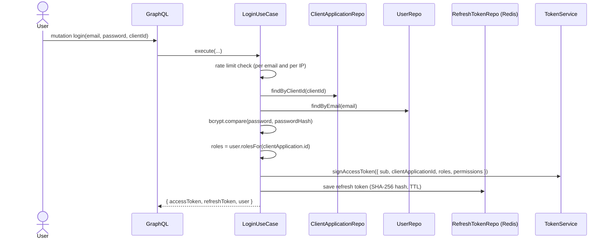
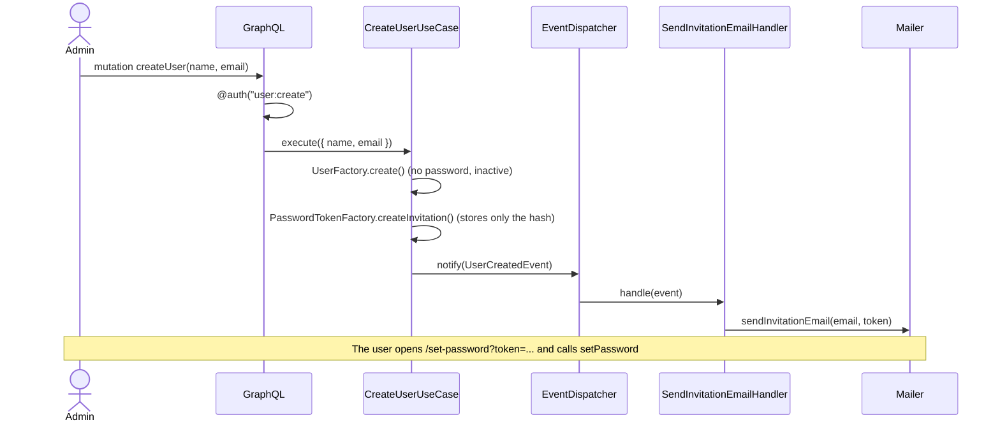
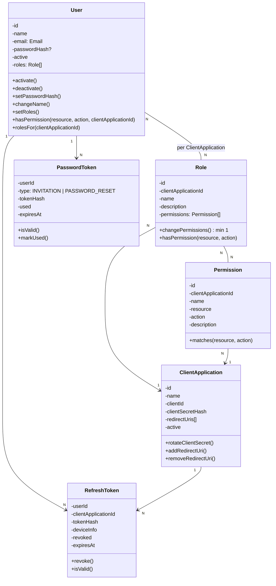

# User Authentication System

A **multi-tenant authentication and authorization server** exposed as a **GraphQL API**. Several client applications delegate login, user management and role-based access control (RBAC) to this single service.

Built with **Node.js 24, TypeScript, Express 5, Apollo Server, PostgreSQL and Redis**, following **Domain-Driven Design (DDD)** and a layered / ports-and-adapters architecture.

> The bounded contexts and design decisions are summarized in [Architecture](#architecture) and [Domain model](#domain-model). The generated API reference is in [docs/api/schema.md](docs/api/schema.md).

---

## Table of contents

- [Features](#features)
- [How it works](#how-it-works)
- [Tech stack](#tech-stack)
- [Architecture](#architecture)
- [Domain model](#domain-model)
- [Project structure](#project-structure)
- [Getting started](#getting-started)
- [Environment variables](#environment-variables)
- [NPM scripts](#npm-scripts)
- [GraphQL API](#graphql-api)
- [Authentication and authorization](#authentication-and-authorization)
- [Security](#security)
- [Error handling](#error-handling)
- [Database and migrations](#database-and-migrations)
- [Running with Docker](#running-with-docker)
- [Testing and code quality](#testing-and-code-quality)
- [Continuous integration](#continuous-integration)
- [License](#license)

---

## Features

- **Multi-tenant by design** — one `User` exists once, but can hold **different roles per client application**.
- **Invitation-based onboarding** — an admin creates a user (name + email, no password); the user receives an email with a link to set their own password.
- **RBAC** — roles and permissions (`resource:action`) scoped per client application.
- **JWT access tokens** (stateless, HS256 via `jose`) carrying the roles and permissions resolved for the client application used at login.
- **Opaque refresh tokens** stored in Redis with native TTL, **rotation** and **reuse detection**.
- **Password reset** flow by email.
- **Rate limiting** on login, password reset and set-password (Redis-backed).
- **Client application management** — client id / secret (hashed), redirect URIs, activate / deactivate, secret rotation.
- **Domain events** decoupling side effects (sending emails) from business rules.
- **Strict multi-tenant isolation** enforced in the GraphQL layer.
- **Production-readiness basics** — structured logging (pino), health check, graceful shutdown, CORS allowlist, query depth limit, introspection disabled in production, validated env config (zod).
- **Generated API docs and types** — SDL + Markdown docs and TypeScript resolver types generated from the schema.
- **Unit test suite** — 300+ fast, infrastructure-free tests (no database, Redis or SMTP needed) covering the domain and application layers. See [Testing and code quality](#testing-and-code-quality).

---

## How it works

### Main business flow

1. An **admin** (a user holding the `user:create` permission in a client application) creates a user, informing only name and email — **no password**.
2. The system generates a `PasswordToken` of type `INVITATION` (only its SHA-256 hash is stored) and dispatches a `UserCreatedEvent`. A handler sends an email with a link like `APP_BASE_URL/set-password?token=...`.
3. The new user calls `setPassword` with the token and a strong password. The user is then **activated**.
4. An admin assigns **roles** to the user for the relevant client application(s). Each role carries a set of **permissions**.
5. The user calls `login(email, password, clientId)` on behalf of a client application and receives an **access token** (JWT) and a **refresh token**.
6. Client applications validate the JWT and use its embedded permissions to authorize actions. This service itself uses the same token to authorize its own GraphQL operations through the `@auth` directive.

### Login



### Invitation and password definition



### Refresh token rotation and reuse detection

- Every `refreshToken` call **revokes** the presented token and issues a new one (same client application and device info).
- The old token is kept in Redis, marked as `revoked`, until it expires on its own.
- If an already-revoked token is presented again, it is treated as **leaked**: **all sessions of that user are terminated** and the request fails.
- `logout` deletes the token; `logoutAllDevices` deletes every active session of the user (via the `user_sessions:<userId>` index).
- Access and permissions are **recalculated on every refresh**, so role changes take effect at the next refresh without a new login.

---

## Tech stack

| Concern              | Choice                                                       |
| -------------------- | ------------------------------------------------------------ |
| Runtime / language   | Node.js 24, TypeScript 7 (ESM)                               |
| HTTP framework       | Express 5 (host for the GraphQL endpoint and `/health`)      |
| API                  | GraphQL — Apollo Server 5 (`@as-integrations/express5`)      |
| Relational database  | PostgreSQL 17 via Sequelize + `sequelize-typescript`         |
| Migrations           | Umzug                                                        |
| Cache / sessions     | Redis 8 via `ioredis` (refresh tokens, rate limiting)        |
| Password hashing     | `bcrypt` (users' passwords and client secrets)               |
| Access token         | `jose` (HS256 JWT)                                           |
| Opaque token hash    | Node `crypto` (SHA-256)                                      |
| Validation           | `zod` (environment variables, password policy)               |
| Email                | `nodemailer` (SMTP) and a console mailer for development     |
| Rate limiting        | `rate-limiter-flexible` on Redis                             |
| Logging              | `pino` + `pino-http`                                         |
| GraphQL tooling      | `@graphql-tools/schema`, `dataloader`, `graphql-depth-limit` |
| Docs / codegen       | `graphql-markdown`, GraphQL Code Generator                   |
| Tests                | Jest 30 (Babel) — unit tests with in-memory fakes            |
| Lint / format        | ESLint + Prettier                                            |
| Containers           | Docker + docker-compose (PostgreSQL and Redis)               |
| Dependency injection | Manual, centralized in `src/container/index.ts`              |

---

## Architecture

The project follows **DDD with a layered architecture**. The dependency rule is: **arrows always point inward**. `Infrastructure` and `Interface` depend on `Application` and `Domain`; the inverse never happens.

```
┌──────────────────────────────────────────────────────────────┐
│  Interface (GraphQL)                                         │  schema, resolvers, directives, DataLoaders
├──────────────────────────────────────────────────────────────┤
│  Application (Use Cases / DTOs / Ports)                      │  orchestrates the domain, no business rules
├──────────────────────────────────────────────────────────────┤
│  Domain (Entities, VOs, Factories, Events, Repository ifaces)│  pure business rules, no external dependencies
├──────────────────────────────────────────────────────────────┤
│  Infrastructure                                              │  concrete implementations of ports
│  ├─ PostgreSQL (Sequelize): User, Role, Permission,          │
│  │   ClientApplication, PasswordToken                        │
│  ├─ Redis (ioredis): RefreshToken, rate limiting             │
│  └─ JWT, Bcrypt, Mailer, Logger, Config                      │
└──────────────────────────────────────────────────────────────┘
```

### Layers

| Layer              | Location             | Responsibility                                                                                                                                                  |
| ------------------ | -------------------- | --------------------------------------------------------------------------------------------------------------------------------------------------------------- |
| **Domain**         | `src/domain`         | Entities, value objects, factories, domain events, domain errors and repository **interfaces**. No framework or I/O dependencies.                               |
| **Application**    | `src/application`    | One use case per file, input/output DTOs, event handlers and **ports** (`HasherInterface`, `MailerInterface`, `TokenServiceInterface`, `RateLimiterInterface`). |
| **Infrastructure** | `src/infrastructure` | Adapters: Sequelize repositories/models/mappers, Redis repositories, JWT, bcrypt, nodemailer, rate limiter, logger, env config, migrations.                     |
| **Interface**      | `src/interface`      | GraphQL schema (SDL), resolvers, `@auth` directive, request context, DataLoaders, error mapping, multi-tenant scope guards.                                     |
| **Composition**    | `src/container`      | Manual dependency injection: instantiates repositories, services, use cases and registers event handlers. Resolvers import ready-made use cases.                |

### Bounded contexts

| Context                                              | Responsibility                       | Entities / VOs                                                        |
| ---------------------------------------------------- | ------------------------------------ | --------------------------------------------------------------------- |
| **Identity** (`domain/user`)                         | User lifecycle, credentials          | `User` (aggregate root), `Email` (VO)                                 |
| **Authorization** (`domain/role`)                    | RBAC — roles and permissions         | `Role`, `Permission` (aggregate roots, scoped by `ClientApplication`) |
| **Client Application** (`domain/client-application`) | Applications that consume the server | `ClientApplication` (aggregate root)                                  |
| **Auth Session** (`domain/auth`)                     | Token issuing and validation         | `RefreshToken`, `PasswordToken` (independent aggregates)              |

### Key design decisions

- **Factories** (`domain/<context>/factory`) generate IDs and build entities. Each has `create(...)` for new entities and `restore(...)` for rehydration from persistence (used by mappers). Entities only enforce invariants.
- **Invariants live in the domain**: e.g. a `Role` can never have zero permissions, and all its permissions must belong to the same client application; `User.activate()` throws if the user has no password yet.
- **Domain events** (`UserCreatedEvent`, `PasswordResetRequestedEvent`) trigger emails without coupling use cases to the mailer. Handlers live in `application/*/event/` because they depend on a port.
- **Repository pattern** with interfaces in the domain and Sequelize/Redis implementations in infrastructure, plus **mappers** between persistence models and domain entities. Lists are paginated (`PaginationParams` / `PaginatedResult<T>`).
- **Polyglot persistence**: strongly consistent "system data" in PostgreSQL; ephemeral, high-churn session data in Redis with native TTL and O(1) revocation.
- **Tokens are never stored in plain text**: only SHA-256 hashes of invitation, reset and refresh tokens; bcrypt hashes for passwords and client secrets.
- **Manual DI** in a single composition root keeps resolvers thin and use cases easy to test: every use case receives its collaborators through the constructor, typed as interfaces, so tests plug in in-memory fakes.

---

## Domain model



Business rules worth knowing:

- A **role cannot exist without permissions** (minimum 1). To "empty" a role, delete it.
- **`(resource, action)` is unique per client application**, and role names are unique per client application.
- A **permission in use** by any role cannot be deleted (`PermissionInUseError`, also enforced by a `RESTRICT` foreign key).
- Login failures for unknown email, missing password, inactive user or wrong password all raise the **same** `InvalidCredentialsError` (prevents email enumeration).
- A password **reset never reactivates** an account deactivated by an admin; only an `INVITATION` token activates the user.
- Setting a password **terminates all existing sessions** of the user.
- Token TTLs: invitation **7 days**, password reset **1 hour**, refresh token **30 days**, access token `JWT_ACCESS_TTL` (default `15m`).

---

## Project structure

```
.
├── .github/workflows/ci.yaml      # CI: format, lint, typecheck, test
├── docs/
│   └── api/
│       ├── schema.graphql         # Generated full SDL (with @auth usages)
│       └── schema.md              # Generated Markdown API reference
├── src/
│   ├── main.ts                    # Entry point: connects Postgres + Redis, mounts GraphQL, starts Express
│   ├── @testing/                  # Test support (excluded from the build): in-memory fakes and entity builders
│   │   ├── fakes/                 # InMemory*Repository, FakeHasher, FakeTokenService, FakeRateLimiter, ...
│   │   └── builders.ts            # makeUser, makeRole, makeClientApplication, ... (object mothers)
│   ├── container/
│   │   └── index.ts               # Composition root (manual DI, event handler registration)
│   ├── domain/
│   │   ├── @shared/               # Event dispatcher, repository contracts, pagination, errors
│   │   ├── user/                  # entity, value-object (Email), factory, event, error, repository interface
│   │   ├── role/                  # Role + Permission: entities, factories, errors, repository interfaces
│   │   ├── client-application/    # entity, factory, errors, repository interface
│   │   └── auth/                  # PasswordToken, RefreshToken, factories, events, errors, repository interfaces
│   ├── application/
│   │   ├── @shared/               # Ports (hasher, mailer, token service, rate limiter), password policy, opaque tokens
│   │   ├── user/                  # create/get/list/update/activate/deactivate/delete user,
│   │   │                          # set-password, assign/remove roles, event/send-invitation-email.handler
│   │   ├── auth/                  # login, refresh-token, logout, logout-all-devices,
│   │   │                          # request-password-reset, event/send-password-reset-email.handler
│   │   ├── role/                  # create/get/list/update/delete role, assign-permissions
│   │   ├── permission/            # create/get/list/update/delete permission
│   │   └── client-application/    # create/get/list/update/delete, rotate-secret,
│   │                              # add/remove redirect URI, activate/deactivate
│   ├── infrastructure/
│   │   ├── config/env.ts          # zod-validated environment (single source of config)
│   │   ├── database/              # sequelize.ts, umzug.ts, migrate.ts, seed-admin.ts, migrations/
│   │   ├── user/ role/ client-application/
│   │   │   └── repository/sequelize/   # models, mappers and repositories
│   │   ├── auth/
│   │   │   ├── repository/sequelize/   # PasswordToken (PostgreSQL)
│   │   │   ├── repository/redis/       # RefreshToken (Redis)
│   │   │   ├── jwt/                    # JoseTokenService (sign/verify) + config
│   │   │   └── hasher/                 # BcryptHasher
│   │   ├── mail/                  # NodemailerMailer, ConsoleMailer, config, send-test-email script
│   │   ├── rate-limit/            # RedisRateLimiter
│   │   ├── redis/                 # ioredis client
│   │   └── logging/               # pino logger
│   ├── interface/graphql/
│   │   ├── schema/                # SDL as .ts files, one per module + shared (directives, PageInfo)
│   │   ├── resolvers/             # thin resolvers delegating to use cases
│   │   ├── directives/            # @auth and @authenticated
│   │   ├── dataloaders/           # roles-by-user loader
│   │   ├── generated/             # GraphQL Code Generator output (resolver argument types)
│   │   ├── context.ts             # Bearer token verification -> currentUser
│   │   ├── errors.ts              # domain error -> GraphQL error code mapping
│   │   ├── pagination.ts          # PaginatedResult -> { items, pageInfo }
│   │   ├── tenant-scope.ts        # multi-tenant isolation guards
│   │   ├── generate-docs.ts       # docs:api generator
│   │   └── server.ts              # ApolloServer + CORS + depth limit, mounted at /graphql
│   └── types/
├── codegen.ts                     # GraphQL Code Generator config
├── docker-compose.yml             # PostgreSQL + Redis
├── Dockerfile                     # Multi-stage production image
├── .env.example                   # Documented environment template
├── jest.config.mjs
├── eslint.config.js
├── tsconfig.json                  # Editor / typecheck config (includes specs)
└── tsconfig.build.json            # Build config (excludes *.spec.ts and src/@testing)
```

Unit tests are **colocated** with the code they test: `create-user.use-case.ts` sits next to `create-user.use-case.spec.ts`.

---

## Getting started

### Prerequisites

- **Node.js 24** and npm
- **Docker** and **Docker Compose** (for PostgreSQL and Redis) — or your own PostgreSQL 17 and Redis 8 instances

### 1. Clone and install

```bash
git clone https://github.com/Itslucassantos/user-authentication-system.git
cd user-authentication-system
npm install
```

### 2. Configure the environment

```bash
cp .env.example .env
```

Edit `.env` and, at a minimum, set:

- `POSTGRES_PASSWORD` — required by `docker-compose.yml`.
- `JWT_ACCESS_SECRET` — **at least 32 characters**. Generate one with:
  ```bash
  node -e "console.log(require('crypto').randomBytes(48).toString('hex'))"
  ```
- `MAIL_HOST` — **remove or comment out** the `MAIL_*` variables for local development to use the console mailer (invite/reset links are printed in the logs instead of being emailed).
- `ADMIN_EMAIL` (and optionally `ADMIN_PASSWORD`, `ADMIN_NAME`, ...) — used by the admin seed.

See [Environment variables](#environment-variables) for the full list.

### 3. Start PostgreSQL and Redis

```bash
docker compose up -d
```

Both services have healthchecks; data is persisted in the `postgres-data` and `redis-data` volumes (Redis runs with AOF enabled).

### 4. Run the migrations

```bash
npm run migrate
```

### 5. Seed the first admin

A fresh database has no way to create the first client application, permissions, role or user through GraphQL (every creation mutation requires `@auth`). The bootstrap seed solves this:

```bash
npm run seed:admin
```

It is **idempotent** and creates (or syncs, if they already exist):

- a **client application** (default name `Admin Console`) — its `clientId` and `clientSecret` are printed once;
- the **17 permissions** used by the schema's `@auth` directives (`user`, `role`, `permission` and `client-application` CRUD, plus `role:assign`);
- an **`admin` role** with all of them;
- an **active admin user** with that role. If `ADMIN_PASSWORD` is not set, a password is generated and printed once.

> Store the printed `clientId` and password: the `clientSecret` and any generated password are never persisted in plain text.

### 6. Start the server

```bash
npm run dev      # development, with auto-reload (tsx watch)
```

or, for a production-like run:

```bash
npm run build
npm start
```

The API is now available at:

| Endpoint                        | Description                              |
| ------------------------------- | ---------------------------------------- |
| `http://localhost:3000/graphql` | GraphQL endpoint (Apollo Sandbox in dev) |
| `http://localhost:3000/health`  | Health check (PostgreSQL + Redis)        |

### 7. Try it out

Log in as the seeded admin (use the `clientId` printed by the seed):

```bash
curl -s http://localhost:3000/graphql \
  -H 'Content-Type: application/json' \
  -d '{
    "query": "mutation($e:String!,$p:String!,$c:String!){ login(email:$e,password:$p,clientId:$c){ accessToken refreshToken user{ id name email } } }",
    "variables": { "e": "<ADMIN_EMAIL>", "p": "<ADMIN_PASSWORD>", "c": "<CLIENT_ID>" }
  }'
```

Use the returned `accessToken` on authenticated requests:

```bash
curl -s http://localhost:3000/graphql \
  -H 'Content-Type: application/json' \
  -H 'Authorization: Bearer <ACCESS_TOKEN>' \
  -d '{ "query": "{ me { id name email roles { name permissions { name } } } }" }'
```

Invite a new user (requires `user:create`):

```graphql
mutation {
  createUser(input: { name: "Jane Doe", email: "jane@example.com" }) {
    id
    active
  }
}
```

With the console mailer, the invitation link (`.../set-password?token=...`) appears in the server logs. The user then completes onboarding:

```graphql
mutation {
  setPassword(token: "<TOKEN_FROM_LINK>", newPassword: "StrongPass1")
}
```

> **Note:** the frontend page behind `APP_BASE_URL/set-password` and `/reset-password` is **not part of this project**. Those links just carry the token; a client application is expected to render the page and call `setPassword`.

---

## Environment variables

All variables are validated with **zod** at startup (`src/infrastructure/config/env.ts`). The app fails fast with an aggregated error message if the configuration is invalid.

| Variable                            | Required | Default       | Description                                                                                                   |
| ----------------------------------- | :------: | ------------- | ------------------------------------------------------------------------------------------------------------- |
| `NODE_ENV`                          |    —     | `development` | `development`, `test` or `production`.                                                                        |
| `PORT`                              |    —     | `3000`        | HTTP port.                                                                                                    |
| `TRUST_PROXY`                       |    —     | `false`       | Set `true` behind a reverse proxy / load balancer so `req.ip` reflects the real client (used by rate limits). |
| `CORS_ALLOWED_ORIGINS`              |    —     | unset         | Comma-separated allowlist of browser origins. Unset: all origins in development, **none** in production.      |
| `POSTGRES_HOST`                     |    —     | `localhost`   | PostgreSQL host.                                                                                              |
| `POSTGRES_PORT`                     |    —     | `5432`        | PostgreSQL port.                                                                                              |
| `POSTGRES_DB`                       |    —     | `auth_db`     | Database name.                                                                                                |
| `POSTGRES_USER`                     |    —     | `auth_user`   | Database user.                                                                                                |
| `POSTGRES_PASSWORD`                 |  yes\*   | empty         | Database password. \*Required by `docker-compose.yml`.                                                        |
| `REDIS_HOST`                        |    —     | `localhost`   | Redis host.                                                                                                   |
| `REDIS_PORT`                        |    —     | `6379`        | Redis port.                                                                                                   |
| `REDIS_DB`                          |    —     | `0`           | Redis logical database index (the integration tests use `15`).                                                |
| `REDIS_PASSWORD`                    |    —     | unset         | Redis password, if any.                                                                                       |
| `JWT_ACCESS_SECRET`                 |   yes    | —             | HS256 signing secret, **minimum 32 characters**.                                                              |
| `JWT_ACCESS_TTL`                    |    —     | `15m`         | Access token lifetime.                                                                                        |
| `MAIL_HOST`                         |    —     | unset         | SMTP host. **Unset → console mailer** (not allowed when `NODE_ENV=production`).                               |
| `MAIL_PORT`                         |    —     | —             | SMTP port (required when `MAIL_HOST` is set).                                                                 |
| `MAIL_USER` / `MAIL_PASSWORD`       |    —     | —             | SMTP credentials; must be set together.                                                                       |
| `MAIL_FROM`                         |    —     | —             | Sender, e.g. `"Auth Service <no-reply@example.com>"` (required when `MAIL_HOST` is set).                      |
| `APP_BASE_URL`                      |   yes    | —             | Base URL used in email links (`/set-password?token=...`, `/reset-password?token=...`).                        |
| `LOGIN_IP_RATE_LIMIT_MAX_ATTEMPTS`  |    —     | `30`          | Failed logins per IP before blocking.                                                                         |
| `LOGIN_IP_RATE_LIMIT_BLOCK_SECONDS` |    —     | `7200`        | Block duration for the per-IP login limit.                                                                    |

Variables read **only by the seed script** (`npm run seed:admin`):

| Variable                 | Required | Default                          | Description                                       |
| ------------------------ | :------: | -------------------------------- | ------------------------------------------------- |
| `ADMIN_EMAIL`            |   yes    | —                                | Email of the admin user.                          |
| `ADMIN_NAME`             |    —     | `Administrator`                  | Admin display name.                               |
| `ADMIN_PASSWORD`         |    —     | generated and printed once       | Admin password.                                   |
| `ADMIN_APP_NAME`         |    —     | `Admin Console`                  | Name of the bootstrap client application.         |
| `ADMIN_APP_REDIRECT_URI` |    —     | `http://localhost:3000/callback` | Redirect URI of the bootstrap client application. |
| `ADMIN_ROLE_NAME`        |    —     | `admin`                          | Name of the admin role.                           |

> Never commit your real `.env`. It is git-ignored; only `.env.example` is versioned.

---

## NPM scripts

| Script                      | Description                                                              |
| --------------------------- | ------------------------------------------------------------------------ |
| `npm run dev`               | Start the server with auto-reload (`tsx watch`).                         |
| `npm run build`             | Compile TypeScript to `dist/` (`tsconfig.build.json`, specs excluded).   |
| `npm start`                 | Run the compiled server (`node dist/main.js`).                           |
| `npm run typecheck`         | Type-check sources **and specs** without emitting.                       |
| `npm run lint` / `lint:fix` | Run ESLint (optionally fixing issues).                                   |
| `npm run format`            | Format all files with Prettier.                                          |
| `npm run format:check`      | Check formatting (used in CI).                                           |
| `npm test`                  | Run the unit test suite (Jest). No external services required.           |
| `npm run test:watch`        | Run Jest in watch mode.                                                  |
| `npm run test:coverage`     | Run Jest with a coverage report (`coverage/`).                           |
| `npm run test:integration`  | Run the integration suite (needs PostgreSQL and Redis running).          |
| `npm run migrate`           | Apply all pending migrations.                                            |
| `npm run migrate:down`      | Revert the last migration.                                               |
| `npm run migrate:pending`   | List pending migrations.                                                 |
| `npm run migrate:executed`  | List executed migrations.                                                |
| `npm run seed:admin`        | Bootstrap client application, permissions, admin role and admin user.    |
| `npm run mail:test`         | Send a test invitation email: `npm run mail:test -- person@example.com`. |
| `npm run docs:api`          | Generate `docs/api/schema.graphql` and `docs/api/schema.md`.             |
| `npm run codegen`           | Run `docs:api`, then generate resolver argument types from the schema.   |

---

## GraphQL API

Endpoint: `POST /graphql`. In non-production environments, Apollo Sandbox is available in the browser at the same URL and introspection is enabled. Full reference: [docs/api/schema.md](docs/api/schema.md) and [docs/api/schema.graphql](docs/api/schema.graphql).

### Operations and required permissions

**Session and password (public or self-service)**

| Operation                          | Access                           |
| ---------------------------------- | -------------------------------- |
| `login(email, password, clientId)` | Public (rate limited)            |
| `refreshToken(refreshToken)`       | Public                           |
| `logout(refreshToken)`             | Public (idempotent)              |
| `logoutAllDevices`                 | Authenticated (`@authenticated`) |
| `setPassword(token, newPassword)`  | Public (rate limited by IP)      |
| `requestPasswordReset(email)`      | Public (rate limited)            |
| `me`                               | Authenticated context            |

**Users**

| Operation                                             | Permission    |
| ----------------------------------------------------- | ------------- |
| `user(id)`, `users(clientApplicationId, page, limit)` | `user:read`   |
| `createUser(input)`                                   | `user:create` |
| `updateUser`, `activateUser`, `deactivateUser`        | `user:update` |
| `deleteUser`                                          | `user:delete` |
| `assignRolesToUser`, `removeRolesFromUser`            | `role:assign` |

**Roles**

| Operation                                     | Permission    |
| --------------------------------------------- | ------------- |
| `role(id)`, `roles(clientApplicationId, ...)` | `role:read`   |
| `createRole`                                  | `role:create` |
| `updateRole`                                  | `role:update` |
| `assignPermissionsToRole`                     | `role:assign` |
| `deleteRole`                                  | `role:delete` |

**Permissions**

| Operation                                                 | Permission          |
| --------------------------------------------------------- | ------------------- |
| `permission(id)`, `permissions(clientApplicationId, ...)` | `permission:read`   |
| `createPermission`                                        | `permission:create` |
| `updatePermission` (description only)                     | `permission:update` |
| `deletePermission`                                        | `permission:delete` |

**Client applications**

| Operation                                                                                                                                          | Permission                  |
| -------------------------------------------------------------------------------------------------------------------------------------------------- | --------------------------- |
| `clientApplication(id)`, `clientApplications(page, limit)`                                                                                         | `client-application:read`   |
| `createClientApplication`                                                                                                                          | `client-application:create` |
| `updateClientApplication`, `rotateClientSecret`, `addRedirectUri`, `removeRedirectUri`, `activateClientApplication`, `deactivateClientApplication` | `client-application:update` |
| `deleteClientApplication`                                                                                                                          | `client-application:delete` |

`createClientApplication` and `rotateClientSecret` return the `clientSecret` in plain text **only once**.

### Pagination

List queries return a connection with `items` and `pageInfo`, and accept `page` (default `1`) and `limit` (default `20`):

```graphql
query {
  roles(clientApplicationId: "<APP_ID>", page: 1, limit: 20) {
    items {
      id
      name
      permissions {
        name
      }
    }
    pageInfo {
      total
      page
      limit
      totalPages
    }
  }
}
```

### Regenerating docs and types

After changing any file in `src/interface/graphql/schema/`:

```bash
npm run codegen
```

This regenerates the SDL, the Markdown reference and the TypeScript argument types used by resolvers, so a schema change not reflected in a resolver breaks `tsc` instead of failing at runtime.

---

## Authentication and authorization

- **Access token**: a signed JWT (HS256) with `sub` (user id), `clientApplicationId`, `roles` and `permissions` (`["resource:action", ...]`). It is **per client application**: it only carries the roles and permissions the user holds in the application used at login.
- **Sending it**: `Authorization: Bearer <accessToken>`. A missing or invalid token results in `currentUser = null`; the directive decides what to do with it.
- **`@auth(permission: "resource:action")`**: field directive that requires an authenticated user **and** the permission in the token (`UNAUTHENTICATED` / `FORBIDDEN` otherwise).
- **`@authenticated`**: requires only a valid token, no specific permission (used by `logoutAllDevices`).
- **Stateless authorization**: the directive compares strings from the token instead of reloading the user on every request. Consequently, permission changes take effect at the next refresh / login (until the access token expires, 15 minutes by default).

### Multi-tenant isolation

A token issued for application A must never read or change application B's data. `src/interface/graphql/tenant-scope.ts` enforces this on `role`, `permission` and `user` operations:

- **Explicit `clientApplicationId` argument** that differs from the token's → `FORBIDDEN`.
- **Resource loaded by ID** (`role(id)`, `permission(id)`) belonging to another application → `null`, indistinguishable from "does not exist".
- **Mutations by ID** on another application's resource → `NOT_FOUND`.
- `users` and `User.roles` **default to the token's application** when the argument is omitted.
- **`ClientApplication` is intentionally not tenant-scoped**: the bootstrap "Admin Console" exists to manage _other_ client applications, so access there is controlled by permission only.

---

## Security

- **Passwords**: bcrypt hashes; policy of 8–128 characters with at least one lowercase letter, one uppercase letter and one digit (`password-policy.ts`).
- **Tokens at rest**: invitation, reset and refresh tokens are random opaque values; **only SHA-256 hashes are stored**. Client secrets are bcrypt-hashed and shown once.
- **Refresh token rotation with reuse detection** (atomic Lua scripts in Redis to prevent concurrent double-use).
- **Rate limiting** (Redis, `rate-limiter-flexible`):

  | Operation              | Key                      | Counts                                  | Limit                  |
  | ---------------------- | ------------------------ | --------------------------------------- | ---------------------- |
  | `login`                | `login:<email>`          | Failures only; reset on success         | 5, then 2 h block      |
  | `login` (secondary)    | `login-ip:<ip>`          | Failures only; **not** reset on success | 30 (configurable), 2 h |
  | `requestPasswordReset` | `password-reset:<email>` | Every request, including unknown emails | 5, then 2 h block      |
  | `setPassword`          | `set-password:<ip>`      | Invalid tokens only                     | 5, then 2 h block      |

  A blocked key is rejected **before** any check, even with the correct password.

- **No user enumeration**: generic credential errors; `requestPasswordReset` succeeds for unknown emails.
- **GraphQL hardening**: query depth limit (10), introspection disabled in production, stack traces never returned, unmapped errors become a generic `INTERNAL_SERVER_ERROR`.
- **CORS**: explicit allowlist via `CORS_ALLOWED_ORIGINS`; in production it fails **closed** (denies all) when unset.
- **Mailer safety**: in production the app refuses to start without `MAIL_HOST`, so invite/reset tokens are never logged by the console mailer.
- **Docker image** runs as the unprivileged `node` user.

---

## Error handling

Domain errors are mapped centrally (`src/interface/graphql/errors.ts`) to GraphQL `extensions.code`:

| Code                    | Source                                                                                             |
| ----------------------- | -------------------------------------------------------------------------------------------------- |
| `UNAUTHENTICATED`       | Missing/invalid token, `InvalidCredentialsError`, `InvalidClientError`, `InvalidRefreshTokenError` |
| `FORBIDDEN`             | Missing permission or cross-tenant access                                                          |
| `NOT_FOUND`             | `*NotFoundError`                                                                                   |
| `CONFLICT`              | `*AlreadyExistsError`, `PermissionInUseError`                                                      |
| `TOO_MANY_REQUESTS`     | Rate limit hit (includes `extensions.retryAfterSeconds`)                                           |
| `BAD_USER_INPUT`        | Validation errors from entities and use cases                                                      |
| `INTERNAL_SERVER_ERROR` | Anything unmapped (details are logged server-side only)                                            |

---

## Database and migrations

Migrations live in `src/infrastructure/database/migrations/` and are executed with Umzug (`npm run migrate`). They are **not** run automatically at application startup.

| Table                 | Purpose                                                            |
| --------------------- | ------------------------------------------------------------------ |
| `users`               | Users (`password_hash` nullable until the invitation is accepted)  |
| `client_applications` | Client applications (unique name)                                  |
| `roles`               | Roles, unique on `(client_application_id, name)`                   |
| `permissions`         | Permissions, unique on `(client_application_id, resource, action)` |
| `user_roles`          | User ↔ role assignment, carrying `client_application_id`           |
| `role_permissions`    | Role ↔ permission (`RESTRICT` on permission delete)                |
| `password_tokens`     | Invitation and password-reset tokens (hashed)                      |

Refresh tokens are **Redis-only** (a former `refresh_tokens` table was dropped by migration):

- `refresh_token:<sha256>` → JSON `{ id, userId, clientApplicationId, deviceInfo, expiresAt, revoked }`, with Redis TTL equal to the token expiry (no cleanup jobs).
- `user_sessions:<userId>` → set of the user's active token hashes, used for "log out of all devices".
- `rl:*` → rate limiter counters.

---

## Running with Docker

`docker-compose.yml` starts the **whole stack** with a single command:

```bash
cp .env.example .env   # set POSTGRES_PASSWORD, JWT_ACCESS_SECRET, ADMIN_EMAIL (and drop MAIL_* to use the console mailer)
docker compose up -d --build
```

Services: `postgres` (17), `redis` (8, protected by `REDIS_PASSWORD` when set), `setup` (one-shot: runs the migrations and the idempotent admin seed, then exits) and `api` (starts after `setup` succeeds; GraphQL at `http://localhost:3000/graphql`, health at `/health`). `POSTGRES_HOST` and `REDIS_HOST` are overridden to the service names inside the containers, so the same `.env` also works for `npm run dev` on the host.

Useful commands: `docker compose logs setup` (prints the admin `clientId`/`clientSecret` and generated password once), `docker compose logs -f api`, `docker compose down` (add `-v` to wipe the data).

To run only the databases and the API on the host, use `docker compose up -d postgres redis` followed by `npm run dev`.

The **`Dockerfile`** builds a multi-stage production image (Node 24 Alpine, production dependencies only, non-root user):

```bash
docker build -t user-authentication-system .

docker run --rm -p 3000:3000 \
  --env-file .env \
  -e NODE_ENV=production \
  -e POSTGRES_HOST=<postgres-host> \
  -e REDIS_HOST=<redis-host> \
  user-authentication-system
```

In production remember to: set `MAIL_*` (SMTP is mandatory), set `CORS_ALLOWED_ORIGINS`, set `TRUST_PROXY=true` behind a proxy, use a strong `JWT_ACCESS_SECRET`, and run `npm run migrate` against the target database before the first start.

---

## Testing and code quality

```bash
npm test               # Jest
npm run test:coverage  # with coverage report
npm run lint
npm run format:check
npm run typecheck
```

### Unit tests

The suite has 300+ tests and runs in a few seconds with **no PostgreSQL, Redis or SMTP**. Coverage of the layers it targets (domain, application, and the bcrypt / JWT adapters) is around 99%.

| Layer                                                   | Strategy                                                                                                                            |
| ------------------------------------------------------- | ----------------------------------------------------------------------------------------------------------------------------------- |
| **Domain** (entities, VOs, factories, events)           | Pure unit tests, no mocks. Every invariant and state transition is covered (required fields, token expiry, tenant isolation, TTLs). |
| **Application** (use cases, handlers, DTO maps)         | Use cases run against **in-memory fakes** of the repository and port interfaces.                                                    |
| **Infrastructure** (`BcryptHasher`, `JoseTokenService`) | Unit tests of the adapters that need no external service (round trip, tampering, expiry, `alg: none`, missing claims).              |

Conventions:

- **Colocated specs** (`*.spec.ts` next to the code) and a `makeSut()` helper per spec that wires the use case with its fakes.
- **Fakes over mocks.** `src/@testing/fakes` has `InMemory*Repository` classes that honour the repository contracts (`delete`/`update` throw `*NotFoundError`, `save` rejects duplicates, the refresh token repository only updates active tokens like the Redis Lua script). They store **snapshots, not references**, so a use case that mutates an entity and forgets to call `update` fails the test. `jest.spyOn` is used only to inject failures or assert that something was _not_ called.
- **Builders** (`src/@testing/builders.ts`) create valid entities with overridable fields (`makeUser({ active: false })`).
- **Security behavior is tested explicitly**: multi-tenant isolation, anti-enumeration, rate limiting, refresh token rotation and reuse detection, single-use tokens, hashed secrets.
- Time-dependent rules use `jest.useFakeTimers().setSystemTime(...)`, never real sleeps.

Jest details (`jest.config.mjs`): `src/**/*.spec.ts` are matched; `.js` import extensions are mapped back to `.ts`; `uuid` and `jose` (ESM-only) go through Babel. Coverage is collected only for layers testable without infrastructure.

### Integration tests

`npm run test:integration` runs `*.int-spec.ts` files against **real PostgreSQL and Redis** (start them with `docker compose up -d postgres redis`). It is separate from `npm test`, which stays infrastructure-free.

```bash
docker compose up -d postgres redis
npm run test:integration
```

**Your development data is never touched.** The suite uses its own database (`<POSTGRES_DB>_test`, created and migrated automatically by the Jest global setup) and Redis DB `15`; the helpers that wipe data refuse to run against anything else. Connection settings come from `.env` or the environment, like the app.

| Area                                 | What is covered                                                                                                                                            |
| ------------------------------------ | ---------------------------------------------------------------------------------------------------------------------------------------------------------- |
| **Sequelize repositories**           | CRUD, unique constraints per tenant, FK `RESTRICT` / `CASCADE`, role/permission replacement, pagination, tenant-scoped listing, not-found errors.          |
| **Redis** (`RefreshTokenRepository`) | TTL, atomic Lua update (only active tokens), revoke keeping the TTL, `deleteAllByUserId`.                                                                  |
| **Redis** (`RedisRateLimiter`)       | Counting, block after the limit, `retryAfter`, per-key isolation, `reset`.                                                                                 |
| **Migrations**                       | All applied, same recorded names from `.ts` and `.js`, schema present, `down` + `up` through the `migrate` CLI.                                            |
| **GraphQL over HTTP (Supertest)**    | Login, refresh rotation and reuse detection, logout, rate limits, invitation / `setPassword`, password reset, user management, `@auth` / `@authenticated`. |
| **Multi-tenant isolation**           | Every cross-tenant read and write path (`FORBIDDEN`, `null`, `NOT_FOUND`) and the default scoping.                                                         |

How it works:

- **Real stack, one stub.** The app's own container and Apollo server are used. Only `NodemailerMailer` is replaced by an in-memory `CapturedMailer`, so tests read the invitation / reset tokens that would have been emailed.
- **Isolation between tests.** Every test starts from truncated tables and a flushed Redis DB (`resetState`); files run serially (`maxWorkers: 1`) because they share the database.
- **Transformer.** Sequelize models use legacy decorators on `declare` fields, which Babel rejects, so this suite compiles with esbuild (`jest.esbuild-transform.cjs`) instead; unit tests keep using Babel.
- Helpers live in `src/@testing/integration/` (`useIntegrationInfrastructure`, `createTenant`, `createGraphQLApp` / `gql`).

Not covered: the real SMTP transport (`NodemailerMailer`) and the `/health` endpoint in `main.ts`.

### Code quality

```bash
npm run lint
npm run format:check
npm run typecheck
```

---

## Continuous integration

GitHub Actions (`.github/workflows/ci.yaml`) runs on every push and pull request to `main`, using Node 24:

1. Prettier format check
2. ESLint
3. TypeScript type check
4. Jest (unit tests)
5. Integration tests, in a separate `integration` job with PostgreSQL 17 and Redis 8 service containers

---

## License

Distributed under the **MIT License**. See [LICENSE](LICENSE) for details.
