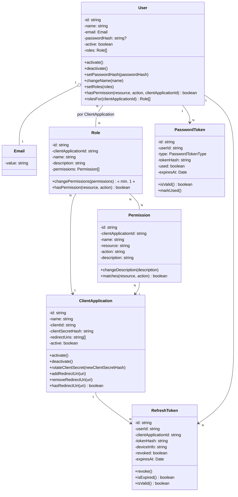
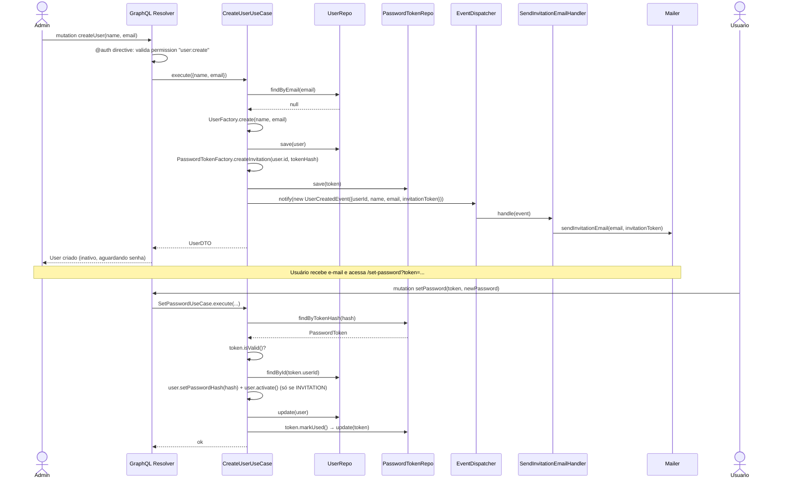
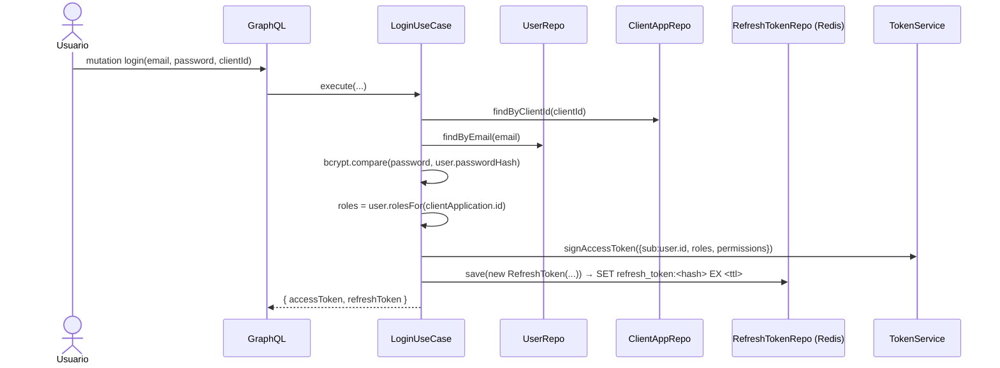
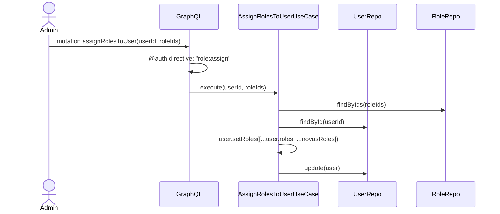

# Modelagem DDD — API de Autenticação e Gerenciamento de Perfis

> Documento de referência para a modelagem de domínio, camadas de arquitetura e organização da API GraphQL. Serve como base para as demais aplicações que vão delegar login e gerenciamento de perfis/permissões a este serviço.

## 1. Visão geral

Este serviço é um **Auth Server multi-tenant**: várias aplicações clientes (`ClientApplication`) confiam nele para autenticar usuários e resolver permissões. Um mesmo `User` pode existir uma única vez, mas ter **papéis (roles) diferentes por aplicação cliente** — é essa relação `UserRole(userId, roleId, clientApplicationId)` já presente no seu schema que sustenta o multi-tenant.

Fluxo de negócio principal:

1. Um **admin** (usuário com permissão `user:create` numa aplicação) cria a conta de um novo usuário informando nome e e-mail — **sem senha**.
2. O sistema gera um `PasswordToken` do tipo `INVITATION` e dispara um e-mail com um link de definição de senha.
3. O novo usuário define a senha através desse link → `User` é ativado (`active = true`).
4. O admin (ou outro admin) atribui **roles** ao usuário para a(s) aplicação(ões) cliente relevante(s). Cada role carrega um conjunto de **permissions**.
5. O usuário faz login (email + senha) em nome de uma `ClientApplication` → recebe um **access token** (JWT, stateless, contém roles/permissions resolvidas) e um **refresh token** (persistido, revogável, vinculado a `userId + clientApplicationId + deviceInfo`).
6. As aplicações clientes validam o JWT localmente (ou via introspection) e usam as permissions embutidas para autorizar ações.

## 2. Bounded contexts

| Contexto                                             | Responsabilidade                      | Entidades/VOs                                                                            |
| ---------------------------------------------------- | ------------------------------------- | ---------------------------------------------------------------------------------------- |
| **Identity** (`domain/user`)                         | Ciclo de vida do usuário, credenciais | `User` (aggregate root), `Email` (VO)                                                    |
| **Authorization** (`domain/role`)                    | RBAC — papéis e permissões            | `Role` (aggregate root), `Permission` (aggregate root, escopada por `ClientApplication`) |
| **Client Application** (`domain/client-application`) | Aplicações que consomem o auth server | `ClientApplication` (aggregate root)                                                     |
| **Auth Session** (`domain/auth`)                     | Emissão/validação de tokens           | `RefreshToken`, `PasswordToken` (aggregates independentes, referenciam `User` por id)    |

Cada contexto vira um módulo próprio em `domain/<contexto>`, como já está organizado — a estrutura atual do repositório já reflete bem essa separação.

## 3. Stack tecnológica

Tudo que o projeto vai usar, por preocupação. O que já está no `package.json` está marcado como **✅ já no projeto**; o resto precisa ser adicionado.

| Preocupação                 | Escolha                                                      | Observação                                                                                                                                                                             |
| --------------------------- | ------------------------------------------------------------ | -------------------------------------------------------------------------------------------------------------------------------------------------------------------------------------- |
| Runtime / linguagem         | Node.js 24 + TypeScript 7                                    | ✅ já no projeto                                                                                                                                                                       |
| Framework HTTP              | Express 5                                                    | ✅ já no projeto — só serve de host pro endpoint GraphQL                                                                                                                               |
| API                         | GraphQL — **GraphQL Yoga** (`graphql-yoga` + `graphql`)      | integra fácil com Express 5, sem vendor lock-in. Alternativa: `@apollo/server`                                                                                                         |
| ORM / banco relacional      | Sequelize + `sequelize-typescript` (Postgres)                | ✅ já no projeto — dados "de sistema" (users, roles, permissions, client applications)                                                                                                 |
| Migrations (Postgres)       | Umzug                                                        | ✅ já no projeto                                                                                                                                                                       |
| **Cache & sessões — Redis** | `ioredis`                                                    | ✅ já no projeto — **refresh tokens** (TTL nativo, revogação instantânea) e store do rate limiter. Ver seção 11.1                                                                      |
| Hash de senha               | `bcrypt` (ou `argon2` se quiser custo maior)                 | usado em `User.passwordHash` e `ClientApplication.clientSecretHash`                                                                                                                    |
| Access token                | `jose`                                                       | ✅ já no projeto — escolhido em vez de `jsonwebtoken` por ser ESM nativo e assíncrono (seção 5.10). JWT assinado, stateless, carrega roles/permissions da `clientApplication` do login |
| Hash de tokens opacos       | Node `crypto` (SHA-256)                                      | usado em `RefreshToken.tokenHash` e `PasswordToken.tokenHash` — não precisa de custo computacional como bcrypt                                                                         |
| Validação de input          | `zod`                                                        | valida env vars na subida da app e inputs que a SDL do GraphQL não cobre (ex.: força de senha)                                                                                         |
| E-mail                      | `nodemailer`                                                 | dev: Mailhog/Ethereal; prod: SMTP do provedor (SES, Sendgrid, etc.) atrás da mesma interface                                                                                           |
| Geração de IDs              | `uuid` (v7, se disponível) ou `ulid`                         | IDs ordenáveis por tempo ajudam em índices/paginação                                                                                                                                   |
| Rate limiting               | `rate-limiter-flexible` usando Redis como store              | ✅ já no projeto — protege `login`, `requestPasswordReset`, `setPassword`: **5 tentativas, depois bloqueio de 2 horas** (seção 5.11)                                                   |
| Logging                     | `pino` (+ `pino-http`)                                       | logs estruturados, correlaciona com `requestId`                                                                                                                                        |
| DI / composition root       | manual (sem framework), centralizado em `container/index.ts` | ver seção 8                                                                                                                                                                            |
| Lint / format               | ESLint + Prettier                                            | ✅ já no projeto                                                                                                                                                                       |
| Testes                      | Jest + Supertest                                             | ✅ já no projeto — testes de domínio (unitários) e resolvers (integração)                                                                                                              |
| Containers                  | Docker + docker-compose                                      | ✅ já no projeto (Postgres + Redis)                                                                                                                                                    |

### Variáveis de ambiente novas

Além das já existentes (`POSTGRES_*`), o `.env` vai precisar de:

```env
# Redis
REDIS_HOST=localhost
REDIS_PORT=6379
REDIS_PASSWORD=

# JWT
JWT_ACCESS_SECRET=troque_por_um_segredo_forte
JWT_ACCESS_TTL=15m
JWT_REFRESH_TTL=30d

# E-mail
MAIL_HOST=localhost
MAIL_PORT=1025
MAIL_FROM="Auth Service <no-reply@seudominio.com>"

# App
APP_BASE_URL=http://localhost:3000
```

### `docker-compose.yml` — serviço Redis a adicionar

```yaml
services:
  redis:
    image: redis:8-alpine
    container_name: user-auth-redis
    restart: unless-stopped
    command: ['redis-server', '--appendonly', 'yes']
    ports:
      - '${REDIS_PORT:-6379}:6379'
    volumes:
      - redis-data:/data
    healthcheck:
      test: ['CMD', 'redis-cli', 'ping']
      interval: 10s
      timeout: 5s
      retries: 5

volumes:
  redis-data:
```

## 4. Modelo de domínio



### Por que `Role` pertence a uma `ClientApplication`?

Porque cada app cliente tem seu próprio conjunto de papéis (ex.: `admin`, `editor` no CRM; `viewer`, `manager` no ERP). `Permission` também pertence a uma `ClientApplication` (`clientApplicationId`, igual a `Role`): cada app define o seu próprio conjunto de permissions (ex.: `user:read`, `invoice:delete`), reutilizável só entre as roles da mesma app.

> **Mudança de decisão**: originalmente `Permission` era um catálogo global compartilhado entre apps. Passou a ser escopada por app para que uma app não enxergue nem dependa das permissions de outra. Consequências: migration `20260908001200-add-permissions-client-application-id.ts` (coluna `client_application_id NOT NULL`, FK `ON DELETE CASCADE` para `client_applications`); **invariante no `Role`** — `validate()` e `changePermissions()` lançam erro se alguma permission tiver `clientApplicationId` diferente da role; `PermissionRepository.findByIds(clientApplicationId, ids)` só devolve permissions daquela app, então `CreateRoleUseCase`/`AssignPermissionsToRoleUseCase` tratam uma permission de outra app como inexistente (`PermissionNotFoundError`).

### Regra: `Role` não pode existir sem `Permission`

Decisão de negócio: uma role sem nenhuma permission não representa nada de útil, então ela é **inválida por construção**. Isso é garantido em dois pontos da entity:

- **Construtor**: `permissions` é obrigatório (não é mais `permissions?: Permission[]`) e `validate()` lança erro se a lista vier vazia.
- **`changePermissions(permissions)`**: também lança erro se `permissions` vier vazia — ou seja, não existe caminho para "esvaziar" uma role em uso. Para remover a última permission, o fluxo correto é **apagar a role** (`deleteRole`), não chamar `changePermissions([])`.

Consequências que isso traz pro resto da modelagem:

- `RoleFactory.create(...)` sempre exige `permissions` não vazio — não é mais um parâmetro opcional (seção 4.1). A mutation `createRole` na SDL (seção 9.1) precisa refletir isso: `permissions: [ID!]!` em vez de opcional.
- Não faz sentido ter `addPermission`/`removePermission` incrementais como métodos separados — como toda alteração de lista passa por `changePermissions`, que já valida "não pode ficar vazia", um único método bulk resolve os dois casos (adicionar e remover) sem duplicar a validação. Por isso eles saem da lista de métodos a implementar.

### 4.1 Factories

Seguindo o padrão do material de referência (Full Cycle, módulo de DDD): uma classe estática por aggregate root em `domain/<contexto>/factory/*.factory.ts`, responsável por gerar o ID (`uuid`) e montar a entity. A entity em si só recebe dados já prontos no construtor e cuida das invariantes — ela não sabe gerar seu próprio ID nem decidir regra de TTL.

Factories necessárias no projeto:

| Factory                    | Métodos                                                                                                                                  | Por quê                                                                                                                                                                                                                                                                                                                                                                                                                                                                                                   |
| -------------------------- | ---------------------------------------------------------------------------------------------------------------------------------------- | --------------------------------------------------------------------------------------------------------------------------------------------------------------------------------------------------------------------------------------------------------------------------------------------------------------------------------------------------------------------------------------------------------------------------------------------------------------------------------------------------------- |
| `UserFactory`              | `create(name, email)` → `User` sem senha e inativo · `restore(props)` → `User` reidratado (usado pelo mapper)                            | Separa "criar um usuário novo" de "reconstruir um usuário existente vindo do banco" — são regras diferentes (o primeiro não tem `passwordHash` ainda).                                                                                                                                                                                                                                                                                                                                                    |
| `RoleFactory`              | `create(clientApplicationId, name, description, permissions)` — `permissions` obrigatório, mínimo 1                                      | Padroniza criação de `Role` e reforça, já na assinatura, que uma role não nasce vazia.                                                                                                                                                                                                                                                                                                                                                                                                                    |
| `PermissionFactory`        | `create(clientApplicationId, name, resource, action, description?)`                                                                      | Padroniza criação de `Permission`.                                                                                                                                                                                                                                                                                                                                                                                                                                                                        |
| `ClientApplicationFactory` | `create(name, clientId, clientSecretHash, redirectUris)` · `restore(id, name, clientId, clientSecretHash, redirectUris, active, roles?)` | Padroniza criação/reidratação de `ClientApplication`. **Diferente do plano original** (`create(name, redirectUris)` gerando tudo internamente): `clientId` e `clientSecretHash` chegam prontos, porque o hash do secret depende do port `HasherInterface`, que o domínio não conhece — quem gera o secret, faz o hash e devolve o texto puro uma única vez é o `CreateClientApplicationUseCase`/`RotateClientSecretUseCase`. `restore` recebe `active` para o estado persistido sobreviver à reidratação. |
| `PasswordTokenFactory`     | `createInvitation(userId, tokenHash)` (TTL longo, ex. 7 dias) · `createPasswordReset(userId, tokenHash)` (TTL curto, ex. 1h)             | Centraliza a regra de expiração por tipo de token — é o item que antes eu tinha sugerido como método estático na própria entity; fica mais alinhado ao padrão de referência como factory.                                                                                                                                                                                                                                                                                                                 |
| `RefreshTokenFactory`      | `create(userId, clientApplicationId, tokenHash, deviceInfo)`                                                                             | TTL conforme `JWT_REFRESH_TTL`.                                                                                                                                                                                                                                                                                                                                                                                                                                                                           |

Exemplo (mesmo padrão do `CustomerFactory`/`OrderFactory` do material de referência):

```ts
// domain/user/factory/user.factory.ts
import { v4 as uuid } from 'uuid';
import User from '../entity/user.js';
import type Email from '../value-object/email.js';
import type Role from '../../role/entity/role.js';

export default class UserFactory {
  static create(name: string, email: Email): User {
    return new User(uuid(), name, email);
  }

  static restore(props: {
    id: string;
    name: string;
    email: Email;
    passwordHash: string | null;
    active: boolean;
    roles: Role[];
  }): User {
    const user = new User(props.id, props.name, props.email);
    if (props.passwordHash) user.setPasswordHash(props.passwordHash);
    if (props.active) user.activate();
    user.setRoles(props.roles);
    return user;
  }
}
```

```ts
// domain/auth/factory/password-token.factory.ts
import { v4 as uuid } from 'uuid';
import PasswordToken from '../entity/password-token.js';
import { PasswordTokenType } from '../enum/password-token-type.enum.js';

const INVITATION_TTL_DAYS = 7;
const PASSWORD_RESET_TTL_HOURS = 1;

export default class PasswordTokenFactory {
  static createInvitation(userId: string, tokenHash: string): PasswordToken {
    const expiresAt = new Date(Date.now() + INVITATION_TTL_DAYS * 24 * 60 * 60 * 1000);
    return new PasswordToken(uuid(), userId, PasswordTokenType.INVITATION, tokenHash, expiresAt);
  }

  static createPasswordReset(userId: string, tokenHash: string): PasswordToken {
    const expiresAt = new Date(Date.now() + PASSWORD_RESET_TTL_HOURS * 60 * 60 * 1000);
    return new PasswordToken(
      uuid(),
      userId,
      PasswordTokenType.PASSWORD_RESET,
      tokenHash,
      expiresAt,
    );
  }
}
```

**Nota sobre `User.validate()`**: o construtor de `User` não recebe mais `passwordHash` (`new User(id, name, email)`) — o campo nasce `null` e só é preenchido depois via `setPasswordHash()`. É uma solução mais explícita do que passar `''` como valor "vazio": `passwordHash: string | null` deixa claro, pelo tipo, que um usuário pode legitimamente não ter senha ainda (aguardando definir via convite), em vez de usar string vazia como sentinel.

**Nota sobre `User.activate()`**: a implementação reforça a invariante do fluxo 6.1 diretamente na entity — `activate()` lança erro se `passwordHash` ainda for `null`. Isso torna impossível ativar um usuário sem senha por qualquer caminho (use case, mapper, teste), sem depender de disciplina externa para respeitar a ordem "definir senha → ativar".

**Nota sobre `restore()` nas factories**: embora a tabela abaixo só cite `restore(props)` explicitamente para `UserFactory`, o mesmo padrão foi replicado para `RoleFactory`, `PermissionFactory`, `ClientApplicationFactory`, `PasswordTokenFactory` e `RefreshTokenFactory` — todas ganharam um `restore(...)` que só monta a entity a partir de dados já existentes (sem gerar novo `id`), usado pelos mappers Sequelize (`role.mapper.ts`, `permission.mapper.ts`, etc.) na reidratação a partir do banco.

### 4.2 Domain Events

Usado só para o efeito colateral que você já tinha em mente: **disparar e-mail quando algo acontece**, sem acoplar essa chamada dentro da regra de criação/atualização. Não generalizamos isso para atribuição de roles/permissions — aquilo continua uma chamada direta no use case.

A infraestrutura de eventos (`EventInterface`, `EventHandlerInterface`, `EventDispatcherInterface`/`EventDispatcher`) é genérica e sem dependências externas, então fica em `domain/@shared/event/` — pode copiar quase literalmente do material de referência:

```ts
// domain/@shared/event/event.interface.ts
export default interface EventInterface {
  dataTimeOccurred: Date;
  eventData: unknown;
}
```

```ts
// domain/@shared/event/event-handler.interface.ts
import type EventInterface from './event.interface.js';

export default interface EventHandlerInterface<T extends EventInterface = EventInterface> {
  handle(event: T): Promise<void> | void;
}
```

> Diferença em relação ao material de referência: lá o `handle` é síncrono (`void`) porque o handler só dá `console.log`. Aqui o handler de convite precisa chamar o `Mailer` (I/O), então `handle` retorna `Promise<void> | void` e o `EventDispatcher.notify` deve dar `await` em cada handler.

Os eventos em si (dado puro, sem comportamento) ficam no contexto de domínio que os dispara:

```ts
// domain/user/event/user-created.event.ts
import type EventInterface from '../../@shared/event/event.interface.js';

export default class UserCreatedEvent implements EventInterface {
  dataTimeOccurred: Date;
  eventData: { userId: string; name: string; email: string; invitationToken: string };

  constructor(eventData: UserCreatedEvent['eventData']) {
    this.dataTimeOccurred = new Date();
    this.eventData = eventData;
  }
}
```

`domain/auth/event/password-reset-requested.event.ts` segue o mesmo padrão, carregando `{ userId, email, resetToken }`.

**Onde ficam os handlers?** No material de referência o handler mora em `domain/product/event/handler/` porque ele não depende de nada externo. No seu caso o handler depende do `MailerInterface` (um port), então ele mora em **`application/<contexto>/event/*.handler.ts`** — mesma régua que já vale pros use cases: domínio não conhece infraestrutura, então o handler que fala com infraestrutura (via port) fica na camada de aplicação.

```ts
// application/user/event/send-invitation-email.handler.ts
import type EventHandlerInterface from '../../../domain/@shared/event/event-handler.interface.js';
import type UserCreatedEvent from '../../../domain/user/event/user-created.event.js';
import type MailerInterface from '../../@shared/mailer.interface.js';

export default class SendInvitationEmailHandler implements EventHandlerInterface<UserCreatedEvent> {
  constructor(private readonly mailer: MailerInterface) {}

  async handle(event: UserCreatedEvent): Promise<void> {
    const { email, invitationToken } = event.eventData;
    await this.mailer.sendInvitationEmail(email, invitationToken);
  }
}
```

O registro dos handlers acontece no composition root, junto com o resto da montagem de dependências:

```ts
// container/index.ts
const eventDispatcher = new EventDispatcher();
eventDispatcher.register(UserCreatedEvent.name, new SendInvitationEmailHandler(mailer));
eventDispatcher.register(
  PasswordResetRequestedEvent.name,
  new SendPasswordResetEmailHandler(mailer),
);

const createUserUseCase = new CreateUserUseCase(
  userRepository,
  passwordTokenRepository,
  eventDispatcher,
  idGenerator,
  hasher,
);
```

## 5. Métodos que faltam nas entities

`User`, `Role` e `Permission` já foram atualizados e estão de acordo com o desenho abaixo (`setPasswordHash`, `changeName`, `setRoles`, `hasPermission`, `rolesFor` no `User`; `changePermissions` com a regra de mínimo 1 e `hasPermission` no `Role`; `matches` e getters `resource`/`action` no `Permission`). `ClientApplication` e `RefreshToken` também já foram implementados (tabela abaixo).

> Nota: o método listado no diagrama da seção 4 como `changeRoles(roles)` foi renomeado para `setRoles(roles)` na implementação, e não chama mais `this.validate()` depois de atribuir — `validate()` não checa nada relacionado a roles, então a revalidação era redundante.

> `Role.hasPermission(resource, action)` não recebe mais `clientApplicationId` — quem filtra por app é o `User`, via `rolesFor(clientApplicationId)`, antes de perguntar pra cada role se ela tem a permission. `Role` não precisa saber nada sobre "para qual app essa pergunta é": ele só responde sobre si mesmo, já que uma instância de `Role` só existe dentro de uma `ClientApplication`. Isso elimina a checagem duplicada que existia antes (`Role` conferindo `clientApplicationId` e `User` também).

| Entity              | Método a adicionar                                                            | Motivo                                                                                                                                                                                           |
| ------------------- | ----------------------------------------------------------------------------- | ------------------------------------------------------------------------------------------------------------------------------------------------------------------------------------------------ |
| `ClientApplication` | `activate()` / `deactivate()`                                                 | Hoje só existe o campo, sem comportamento. ✅ implementado                                                                                                                                       |
| `ClientApplication` | `rotateClientSecret(hash)`                                                    | Rotação de segredo sem recriar o registro. ✅ implementado                                                                                                                                       |
| `ClientApplication` | `addRedirectUri` / `removeRedirectUri` / `hasRedirectUri`                     | Necessário para validar `redirect_uri` no fluxo OAuth-like. ✅ implementado                                                                                                                      |
| `RefreshToken`      | `isValid()`                                                                   | `!revoked && !isExpired()`, evita repetir a regra em todo lugar que consome o token. ✅ implementado                                                                                             |
| `Permission`        | getter `id`                                                                   | Faltava para os repositórios (ex.: `RoleRepository.save`/`update`) conseguirem extrair os IDs das permissions da entity de domínio e associá-las via `$set('permissions', ids)`. ✅ implementado |
| `Role`              | `changeName(name)` / `changeDescription(description)`                         | Gap detectado ao levantar o CRUD completo (seção 8.1) — necessário para `UpdateRoleUseCase`. Ambos validam valor não vazio. ✅ implementado                                                      |
| `ClientApplication` | `changeName(name)`                                                            | Gap detectado ao levantar o CRUD completo (seção 8.1) — necessário para `UpdateClientApplicationUseCase`. ✅ implementado (lança erro se `name` vazio, mesmo padrão de `Role.changeName`)        |
| `Permission`        | campo/getter `clientApplicationId`                                            | Permission passou a pertencer a uma `ClientApplication` (seção 4, "Mudança de decisão"). Obrigatório no `validate()`. ✅ implementado                                                            |
| `Role`              | invariante "permissions da mesma app" em `validate()` / `changePermissions()` | Uma role não pode ter permission de outra `ClientApplication` — lança erro. ✅ implementado                                                                                                      |

Esses métodos ficam na **camada de domínio**, mesma régua usada pros que já foram implementados — a lógica de autorização (`hasPermission`) não deveria morar em resolver nem em use case, para não ficar espalhada e sem teste unitário direto. A criação de `PasswordToken` (com TTL por tipo) fica a cargo do `PasswordTokenFactory`, descrito na seção 4.1.

### 5.1 Paginação genérica em repositórios

`RepositoryInterface<T>` (`domain/@shared/repository/repository-interface.ts`) ganhou paginação no `findAll`, algo que não estava previsto nas seções anteriores deste documento:

### 5.2 `RoleRepository` (Sequelize) implementado

Os cinco métodos (`findById`, `findAll`, `save`, `update`, `delete`) foram implementados seguindo o mesmo padrão já usado no `UserRepository`:

- **Eager loading de permissions**: `findById`/`findAll` usam `include: [PermissionModel]` para trazer a associação `BelongsToMany` (via `RolePermissionModel`) já resolvida, e `RoleMapper.toDomain` + `PermissionMapper.toDomain` reidratam a entity com `RoleFactory.restore`/`PermissionFactory.restore`.
- **Persistência da associação role↔permission**: como `permissions` é uma associação (`role_permissions`), não uma coluna, `RoleMapper.toPersistence` não inclui mais o campo `permissions` (passá-lo pro `RoleModel.create()` sem `include` era silenciosamente ignorado pelo Sequelize). Em vez disso, `save`/`update` chamam `model.$set('permissions', entity.permissions.map(p => p.id))` dentro da mesma `sequelize.transaction(...)` do `create`/`update` do model — atômico, então a role nunca fica persistida sem nenhuma permission (o que violaria a invariante da seção "Regra: Role não pode existir sem Permission").
- **Detecção real de duplicidade**: foi adicionada a migration `20260908000800-add-roles-unique-name-per-client-application.ts`, com unique constraint composta em `roles(client_application_id, name)` — o mesmo nome de role pode existir em `ClientApplication`s diferentes, mas não duas vezes na mesma app. O `catch` de `save`/`update` mapeia `UniqueConstraintError` para `RoleAlreadyExistsError` (`domain/role/error/role-already-exists-error.ts`).
- **Erro de "não encontrado"**: `update`/`delete` agora lançam `RoleNotFoundError` (`domain/role/error/role-not-found-error.ts`) em vez de um `Error` genérico. O `catch` de cada método faz `if (error instanceof RoleNotFoundError) throw error;` antes de embrulhar qualquer outra falha em `RepositoryError` — sem esse re-throw explícito, o erro de domínio seria mascarado como `RepositoryError` genérico. O mesmo padrão (`UserNotFoundError`) foi replicado no `UserRepository.update`/`delete` para manter os dois repositórios consistentes.

> Bug corrigido pelo caminho: a ordem dos decorators `@Column`/`@Default` em `UserModel.passwordHash` estava invertida em relação ao padrão usado em `active` (decorators do `sequelize-typescript` aplicam de baixo pra cima), o que quebrava qualquer `npm run migrate` com `Error: @Column annotation is missing for "passwordHash"`. Corrigido colocando `@Default` acima de `@Column`, igual `active`.

```ts
findAll(params: PaginationParams): Promise<PaginatedResult<T>>;
```

`PaginationParams` (`{ page, limit }`) e `PaginatedResult<T>` (`{ items, total, page, limit, totalPages }`) ficam em `domain/@shared/repository/pagination.ts`. Motivo: um `findAll()` sem limite não escala para tabelas como `users` ou `roles` conforme a base cresce — toda implementação de repositório (Sequelize, Redis, etc.) deve seguir esse contrato daqui pra frente, não só `UserRepository`.

### 5.3 `PasswordTokenRepository` (Sequelize) implementado e `UserRepository.findByEmail`

Os seis métodos (`findById`, `findByTokenHash`, `findAll`, `save`, `update`, `delete`) foram implementados seguindo o mesmo padrão do `UserRepository`/`RoleRepository`:

- **`findByTokenHash`**: era o item pendente da seção 13 usado no fluxo de `setPassword`/reset de senha (seção 6.1) para localizar o token a partir do hash recebido do usuário. Não faz parte do `RepositoryInterface<T>` genérico — foi adicionado direto na `PasswordTokenRepositoryInterface`, já que só `PasswordToken` é buscado por hash de token.
- **`UserRepository.findByEmail(email: Email)`**: também implementado (mesmo item pendente da seção 13), usado no `CreateUserUseCase` (seção 9.2) para checar `UserAlreadyExistsError` antes de criar, e no `LoginUseCase` (seção 6.2).
- **Getters na entity `PasswordToken`**: não existia nenhum getter público — `id`, `userId`, `type`, `tokenHash`, `used`, `expiresAt` foram adicionados para o mapper conseguir montar o objeto de persistência (mesma necessidade que já valia para `User`/`Role`).
- **`PasswordTokenFactory.restore` ganhou o parâmetro `used`**: sem isso, reidratar do banco um token que já tinha sido usado voltaria com `_used = false` (valor padrão do construtor), e `isValid()` responderia errado para um token já consumido.
- **Erro de "não encontrado"**: `update`/`delete` lançam `PasswordTokenNotFoundError` (`domain/auth/error/password-token-not-found-error.ts`), mesmo padrão de `UserNotFoundError`/`RoleNotFoundError` — o `catch` re-lança explicitamente antes de embrulhar outras falhas em `RepositoryError`.
- **Sem tratamento de `UniqueConstraintError` em `save`**: diferente de `User`/`Role`, a migration de `password_tokens` não tem unique constraint — não existe regra de negócio de unicidade sobre `tokenHash` (colisão de hash é praticamente impossível, e mesmo que ocorresse não seria um erro de domínio a mapear).
- **Renomeação do model**: `infrastructure/auth/repository/sequelize/password-token.ts` → `password-token.model.ts`, para não colidir o nome do arquivo/import com a entity de domínio `PasswordToken` (o repositório precisa importar os dois) e para seguir a mesma convenção de `user.model.ts`/`role.model.ts`.

### 5.4 `UserRepository.findAllByClientApplication` (Sequelize) implementado

Método novo em `UserRepositoryInterface` (não estava previsto nas seções anteriores), adicionado para o `ListUsersUseCase` (seção 8.1) resolver a query `users(clientApplicationId: ID)` (seção 9.1) — o `RepositoryInterface<T>.findAll` genérico não tem como filtrar, e generalizar filtro no contrato genérico afetaria `Role`/`Permission`/`ClientApplication` sem necessidade, então o método ficou só em `UserRepositoryInterface`, ao lado de `findByEmail`.

Implementação: `include: [{ model: RoleModel, required: true, where: { clientApplicationId }, include: [PermissionModel] }]` — o `required: true` faz um inner join, restringindo aos usuários que têm ao menos uma role naquela `ClientApplication`. Efeito colateral a manter em mente: a entity `User` reidratada por esse método carrega em `roles` só as roles daquela `ClientApplication`, não todas as do usuário — diferente de `findById`/`findAll`/`findByEmail`, que trazem todas. Não é um problema para o `ListUsersUseCase` (o DTO de saída não expõe `roles`), mas qualquer uso futuro desse método precisa saber disso.

### 5.5 `PermissionRepository` (Sequelize) implementado

Criado para o `CreateRoleUseCase` (seção 8.1) resolver `permissionIds` → entities `Permission`: a mutation `createRole` recebe `permissionIds: [ID!]!` (seção 9.1), não entities de domínio, então o use case precisa buscar e validar que cada id existe.

- **`PermissionRepositoryInterface`** (`domain/role/repository/permission-repository.interface.ts`): estende `RepositoryInterface<Permission>` e adiciona `findByIds(clientApplicationId, ids)` (filtra pela app, ver seção 4) e `findAllByClientApplication(clientApplicationId, params)` (paginado, usado pelo `ListPermissionsUseCase`, mesmo papel do método homônimo de `RoleRepository` — seção 5.6).
- **Implementação** (`infrastructure/role/repository/sequelize/permission.repository.ts`): `findById`, `findByIds`, `findAll` (paginado), `save`, `update`, `delete`. `update`/`delete` lançam `PermissionNotFoundError` (`domain/role/error/permission-not-found-error.ts`) e re-lançam antes de embrulhar outras falhas em `RepositoryError`, mesmo padrão dos demais repositórios.
- **Unicidade de `(resource, action)` por app**: migration `20260908001300-add-permissions-unique-resource-action-per-client-application.ts` cria a unique constraint composta `permissions(client_application_id, resource, action)` — a mesma dupla pode existir em apps diferentes, mas não duas vezes na mesma app (mesmo raciocínio de `roles(client_application_id, name)`). `findByResourceAndAction(clientApplicationId, resource, action)` é usado pelo `CreatePermissionUseCase` para lançar `PermissionAlreadyExistsError` (`domain/role/error/permission-already-exists-error.ts`) antes de salvar, e o `save` mapeia `UniqueConstraintError` para o mesmo erro (corrida entre requisições). `update` não precisa do mapeamento: `resource`/`action` são imutáveis.
- **`isInUse(id)`**: `count` em `role_permissions`, usado pelo `DeletePermissionUseCase` (seção 8.1) para bloquear o delete de uma permission associada a alguma role. `delete` também mapeia `ForeignKeyConstraintError` para `PermissionInUseError` (`domain/role/error/permission-in-use-error.ts`), como rede de segurança da FK `RESTRICT`.
- **Getters `name`/`description` na entity `Permission`** e **`PermissionMapper.toPersistence`**: necessários para o repositório montar o objeto de persistência.

### 5.6 `RoleRepository.findAllByClientApplication` (Sequelize) implementado

Mesmo papel do `UserRepository.findAllByClientApplication` (seção 5.4), para o `ListRolesUseCase` resolver a query `roles(clientApplicationId: ID!)` (seção 9.1). Segue o contrato de paginação da seção 5.1: recebe `PaginationParams` e devolve `PaginatedResult<Role>`. Filtra por `where: { clientApplicationId }` direto na tabela `roles` (sem join, já que a role pertence a uma única app) e mantém `include: [PermissionModel]` + `distinct: true` para o `count` não ser inflado pelas permissions.

Diferente de `users`, aqui `clientApplicationId` é **obrigatório**: `User` é global, mas `Role` só existe dentro de uma `ClientApplication` (seção 4), então não existe caso de uso para listar roles de todas as apps misturadas — o `ListRolesUseCase` não cai no `findAll` genérico.

### 5.7 `ClientApplicationRepository` (Sequelize) implementado

Usado pelo módulo `client-application` (seção 8.1) e pelo `CreateRoleUseCase`/`CreatePermissionUseCase` para validar que a app existe.

- **Métodos**: `findById`, `findByName`, `findAll` (paginado, seção 5.1), `save`, `update`, `delete` — `findById`/`findByName`/`findAll` fazem eager loading de `roles` (com `permissions`).
- **`findByName(name)`**: não faz parte do `RepositoryInterface<T>` genérico — adicionado em `ClientApplicationRepositoryInterface` para o `CreateClientApplicationUseCase`/`UpdateClientApplicationUseCase` rejeitarem nome duplicado antes de salvar, mesmo papel do `RoleRepository.findByName`.
- **Nome único**: reforçado no banco pela migration `20260908001000-add-client-applications-unique-name.ts`; `save`/`update` mapeiam `UniqueConstraintError` para `ClientApplicationAlreadyExistsError` (rede de segurança para requisições concorrentes).
- **`update`/`delete`** lançam `ClientApplicationNotFoundError` quando nenhuma linha é afetada, e re-lançam antes de embrulhar outras falhas em `RepositoryError`.
- **Bug corrigido — `active` perdido na reidratação**: `ClientApplicationFactory.restore` não recebia `active` e a entity nasce com `active = true`, então toda app lida do banco voltava ativa e o `DeactivateClientApplicationUseCase` não tinha efeito persistente. Agora `toDomain` passa `model.active` para o `restore`.

### 5.8 `ClientApplicationRepository.findByClientId` e `TokenServiceInterface`

Adicionados para o `LoginUseCase` (seção 6.2):

- **`findByClientId(clientId)`** em `ClientApplicationRepositoryInterface`: a mutation `login` recebe o `clientId` público da app, não o `id` interno, então `findById` não serve. Mesmo padrão de `findByName` (eager loading de `roles`).
- **`TokenServiceInterface`** (`application/@shared/token-service.interface.ts`): port com `signAccessToken(payload): Promise<string>` e o tipo `AccessTokenPayload` (`sub`, `clientApplicationId`, `roles`, `permissions`). Assíncrono para aceitar tanto `jsonwebtoken` quanto `jose`. A implementação (`infrastructure/auth/jwt/`) continua pendente.
- **Erros de domínio** em `domain/auth/error/`: `InvalidCredentialsError` (mensagem genérica, sem dizer se o e-mail existe) e `InvalidClientError`.

### 5.9 `RefreshToken`: getters, `restore(..., revoked)` e `findByTokenHash`

Adicionados para o `RefreshTokenUseCase`:

- **Getters na entity `RefreshToken`** (`id`, `userId`, `clientApplicationId`, `tokenHash`, `deviceInfo`, `revoked`, `expiresAt`): não existia nenhum — mesma necessidade que já valeu para `PasswordToken` (seção 5.3).
- **`RefreshTokenFactory.restore` ganhou `revoked`**: mesmo bug evitado no `PasswordTokenFactory.restore` com `used` — sem isso, um token revogado reidratado voltaria válido.
- **`RefreshTokenRepositoryInterface.findByTokenHash(tokenHash)`**: o cliente só conhece o token em texto puro; no Redis é um `GET refresh_token:<hash>` direto (seção 11.1). O `update` de um token revogado **não** vira `DEL` — ele é mantido como marcador revogado para a detecção de reuso (seção 5.10).

### 5.10 `RefreshTokenRepository` (Redis) e detecção de reuso

**`RefreshTokenRepositoryInterface` deixou de estender `RepositoryInterface<T>`** — contrato próprio: `findByTokenHash`, `save`, `update`, `delete(entity)`, `deleteAllByUserId(userId)`. No Redis o token é endereçado pelo hash, não pelo `id`, e não existe caso de uso para `findById`/`findAll` paginado de sessões (exigiria índices extras só para cumprir o contrato genérico). `delete` recebe a entity porque precisa do `userId` para tirar o hash de `user_sessions:<userId>`.

Layout no Redis (seção 11.1):

- `refresh_token:<sha256>` → JSON `{ id, userId, clientApplicationId, deviceInfo, expiresAt, revoked }`, com `PX` = `expiresAt - agora`.
- `user_sessions:<userId>` → `SET` com os hashes **ativos** do usuário; TTL renovado a cada `save`.

Regras:

- **`update` é atômico (script Lua)** e só altera um token que existe e **não** está revogado; senão lança `RefreshTokenNotFoundError`. É isso que garante que, entre duas requisições concorrentes com o mesmo refresh token, só uma consegue rotacionar — a outra recebe `InvalidRefreshTokenError`.
- **Rotação não apaga o token antigo**: ele é regravado com `revoked: true` (`KEEPTTL`) e sai de `user_sessions`. Fica como marcador até expirar sozinho.
- **Detecção de reuso** (`RefreshTokenUseCase`): se chegar um token já revogado por rotação, é sinal de que ele vazou (o cliente legítimo já recebeu o sucessor) — todas as sessões do usuário são derrubadas (`deleteAllByUserId`) e a requisição falha. Consequência a ter em mente: um cliente que reenvie o mesmo refresh token depois de já ter rotacionado (ex.: duas abas sem sincronizar) também derruba as sessões — não há janela de tolerância.
- **Logout apaga** (`DEL`), não marca como revogado: um token de logout reapresentado é só inválido, não dispara reuso.
- **`deleteAllByUserId`** também é um script Lua (lê o `SET` e apaga as chaves na mesma operação), para uma sessão criada no meio não escapar do índice.

`JoseTokenService` (`infrastructure/auth/jwt/`): `jose` em vez de `jsonwebtoken` por ser ESM nativo e assíncrono (casa com `signAccessToken(): Promise<string>`). HS256, `sub` = `userId`, claims `clientApplicationId`/`roles`/`permissions`, `exp` = `JWT_ACCESS_TTL` (padrão `15m`). `loadJwtConfig` exige `JWT_ACCESS_SECRET` com no mínimo 32 caracteres. A verificação do token (usada pela directive `@auth`) fica para quando a camada GraphQL existir.

### 5.11 Rate limiting

Regra: **5 tentativas; na 5ª, a chave fica bloqueada por 2 horas** (TTL contado a partir do bloqueio). Durante o bloqueio, a requisição falha com `TooManyRequestsError` (`retryAfterSeconds`) **antes** de qualquer checagem — inclusive com a senha certa, senão o bloqueio não impediria a força bruta.

- **Port** `RateLimiterInterface` (`application/@shared/rate-limiter.interface.ts`): `ensureNotBlocked(key)` (só consulta, não gasta tentativa), `hit(key)` (registra uma tentativa e bloqueia ao atingir o limite) e `reset(key)`. Fica na camada de aplicação porque quem sabe _o que conta como tentativa_ é o use case; a interface GraphQL ainda não existe.
- **Implementação** `RedisRateLimiter` (`infrastructure/rate-limit/`): `rate-limiter-flexible` (`RateLimiterRedis`, prefixo `rl`) sobre o mesmo client `ioredis`. Limite e duração são configuráveis no construtor, com padrão `{ maxAttempts: 5, blockSeconds: 7200 }`.

| Use case                      | Chave                                  | O que conta como tentativa                                                                                                                                                                                                          |
| ----------------------------- | -------------------------------------- | ----------------------------------------------------------------------------------------------------------------------------------------------------------------------------------------------------------------------------------- |
| `LoginUseCase`                | `login:<email em minúsculas>`          | Só **falhas** (e-mail inexistente, sem senha, inativo ou senha errada). Login com sucesso zera o contador — contar sucessos bloquearia quem só loga em vários dispositivos.                                                         |
| `RequestPasswordResetUseCase` | `password-reset:<email em minúsculas>` | **Toda** requisição, inclusive para e-mail desconhecido (senão o comportamento do limite revelaria quais e-mails existem). Evita usar o endpoint para inundar a caixa de alguém.                                                    |
| `SetPasswordUseCase`          | `set-password:<ipAddress>`             | Só **tokens inválidos** (inexistente, expirado ou já usado). Por IP porque cada chute de token tem um hash diferente — limitar por token não teria efeito. `ipAddress` entra no `SetPasswordInputDto` e vem do resolver (`req.ip`). |

Decisões e limitações:

- **Login sem limite por IP**: com 5 tentativas / 2 h, limitar por IP bloquearia usuários atrás do mesmo NAT (empresa, rede móvel). Consequência: credential stuffing (uma senha testada em muitos e-mails, a partir de um IP) não é contido. Se for preciso, adicionar uma segunda chave por IP com limite bem maior.
- **E-mail em minúsculas na chave**, para variações de caixa (`Ana@x.com`/`ana@x.com`) não ganharem contadores separados.
- Um login com sucesso zera o contador, então o limite é de **5 falhas consecutivas**.

## 6. Fluxos principais

### 6.1 Admin cria usuário → convite por e-mail → definição de senha



**Decisão de design:** o `User` nasce sem senha (`passwordHash: null`) e **inativo** — o construtor de `User` não recebe mais `passwordHash`; use `UserFactory.create(name, email)` vs. `UserFactory.restore(...)` usado pelo mapper ao reidratar do banco (seção 4.1). O token de convite em texto puro (`invitationToken`) só existe na memória dessa requisição — o que é persistido é o hash (`PasswordToken.tokenHash`); ele viaja até o `Mailer` via `eventData`, nunca é salvo em lugar nenhum.

### 6.2 Login



A implementação em `infrastructure` faz `SET` no Redis com expiração igual ao `expiresAt` calculado pela entity, usando `tokenHash` como parte da chave. O `RefreshTokenRepositoryInterface` **mudou** em relação ao plano original (deixou de estender `RepositoryInterface<T>`), e revogar por rotação **não** é `DEL`: o token fica marcado como revogado até expirar, para a detecção de reuso. Só o logout apaga. Detalhes na seção 5.10.

### 6.3 Admin atribui roles/permissions



## 7. Arquitetura em camadas

```
┌─────────────────────────────────────────────┐
│  Interface (GraphQL)                         │  schema, resolvers, directives, DataLoaders
├─────────────────────────────────────────────┤
│  Application (Use Cases / DTOs / Ports)      │  orquestra o domínio, sem regra de negócio
├─────────────────────────────────────────────┤
│  Domain (Entities, VOs, Repository Interfaces│  regra de negócio pura, sem dependências
│  Domain Errors)                              │  externas
├─────────────────────────────────────────────┤
│  Infrastructure                               │  implementações concretas dos ports
│  ├─ Postgres (Sequelize) → User, Role,        │  dados de sistema, consistência forte
│  │  Permission, ClientApplication, PasswordToken
│  ├─ Redis (ioredis) → RefreshToken, rate limit│  dados efêmeros com TTL nativo
│  ├─ JWT, Bcrypt, Mailer, Logger, Config       │
└─────────────────────────────────────────────┘
```

Regra de dependência: **as setas sempre apontam para dentro**. `Infrastructure` e `Interface` dependem de `Application`/`Domain`; o inverso nunca acontece (é por isso que hoje `domain/*/repository/*.interface.ts` fica no domínio e só a implementação Sequelize fica em `infrastructure`).

A camada que falta hoje no projeto é a **Application** — atualmente os resolvers (ainda não criados) tenderiam a falar direto com repositório. Introduzir Use Cases evita regra de negócio vazando pro resolver GraphQL.

## 8. Estrutura de pastas proposta

```
src/
├── domain/
│   ├── user/
│   │   ├── entity/user.ts
│   │   ├── value-object/email.ts
│   │   ├── factory/user.factory.ts             ✅
│   │   ├── event/user-created.event.ts         ✅
│   │   ├── error/
│   │   └── repository/user-repository.interface.ts
│   ├── role/
│   │   ├── entity/{role.ts,permission.ts}
│   │   ├── factory/{role.factory.ts,permission.factory.ts}   ✅
│   │   ├── error/
│   │   └── repository/{role-repository.interface.ts,permission-repository.interface.ts}
│   ├── client-application/
│   │   ├── entity/client-application.ts
│   │   ├── factory/client-application.factory.ts ✅
│   │   ├── error/
│   │   └── repository/client-application-repository.interface.ts
│   ├── auth/
│   │   ├── entity/{password-token.ts,refresh-token.ts}
│   │   ├── factory/{password-token.factory.ts,refresh-token.factory.ts} ✅
│   │   ├── error/                              ✅ InvalidCredentials, InvalidClient, InvalidRefreshToken, RefreshTokenNotFound, PasswordTokenNotFound
│   │   ├── repository/{password-token-repository.interface.ts,refresh-token-repository.interface.ts} ✅
│   │   └── event/password-reset-requested.event.ts ✅
│   └── @shared/
│       ├── event/                              ✅ EventInterface, EventHandlerInterface, EventDispatcher(Interface)
│       ├── error/
│       └── repository/
│
├── application/                     # use cases (1 arquivo = 1 caso de uso) — CRUD completo, ver seção 8.1
│   ├── user/
│   │   ├── create-user/{create-user.use-case.ts,create-user.dto.ts}        ✅
│   │   ├── get-user/get-user.use-case.ts                                  ✅ serve `user(id)` e `me` (ver seção 8.1)
│   │   ├── list-users/list-users.use-case.ts                              ✅
│   │   ├── update-user/update-user.use-case.ts                            ✅
│   │   ├── activate-user/activate-user.use-case.ts                        ✅
│   │   ├── deactivate-user/deactivate-user.use-case.ts                    ✅
│   │   ├── delete-user/delete-user.use-case.ts                            ✅
│   │   ├── set-password/set-password.use-case.ts                         ✅
│   │   ├── assign-roles/assign-roles-to-user.use-case.ts                 ✅
│   │   ├── remove-roles/remove-roles-from-user.use-case.ts                ✅
│   │   └── event/send-invitation-email.handler.ts                        ✅ EventHandlerInterface<UserCreatedEvent>
│   ├── auth/
│   │   ├── login/{login.use-case.ts,login.dto.ts}                        ✅
│   │   ├── refresh-token/{refresh-token.use-case.ts,refresh-token.dto.ts} ✅
│   │   ├── @shared/auth-payload-output.dto.ts                            ✅ AuthPayloadOutputDto + toAccessTokenPayload
│   │   ├── logout/{logout.use-case.ts,logout.dto.ts}                     ✅
│   │   ├── logout-all-devices/{logout-all-devices.use-case.ts,logout-all-devices.dto.ts} ✅
│   │   ├── request-password-reset/{request-password-reset.use-case.ts,request-password-reset.dto.ts} ✅
│   │   └── event/send-password-reset-email.handler.ts   ✅ EventHandlerInterface<PasswordResetRequestedEvent>
│   ├── role/
│   │   ├── create-role/create-role.use-case.ts                           ✅
│   │   ├── get-role/get-role.use-case.ts                                 ✅
│   │   ├── list-roles/list-roles.use-case.ts                             ✅
│   │   ├── update-role/update-role.use-case.ts                           ✅
│   │   ├── assign-permissions/assign-permissions-to-role.use-case.ts     ✅
│   │   ├── delete-role/delete-role.use-case.ts                           ✅
│   │   └── @shared/role-output.dto.ts                                    ✅ RoleOutputDto (reusa PermissionOutputDto)
│   ├── permission/
│   │   ├── create-permission/{create-permission.use-case.ts,create-permission.dto.ts}  ✅
│   │   ├── get-permission/get-permission.use-case.ts                    ✅
│   │   ├── list-permissions/list-permissions.use-case.ts                ✅
│   │   ├── update-permission/update-permission.use-case.ts              ✅ só changeDescription
│   │   ├── delete-permission/delete-permission.use-case.ts              ✅ restrict se em uso (PermissionInUseError)
│   │   └── @shared/permission-output.dto.ts                             ✅ PermissionOutputDto + toPermissionOutputDto
│   ├── client-application/
│   │   ├── create-client-application/{create-client-application.use-case.ts,create-client-application.dto.ts}  ✅
│   │   ├── get-client-application/get-client-application.use-case.ts  ✅
│   │   ├── list-client-applications/list-client-applications.use-case.ts  ✅
│   │   ├── update-client-application/update-client-application.use-case.ts  ✅
│   │   ├── rotate-client-secret/rotate-client-secret.use-case.ts  ✅
│   │   ├── add-redirect-uri/add-redirect-uri.use-case.ts  ✅
│   │   ├── remove-redirect-uri/remove-redirect-uri.use-case.ts  ✅
│   │   ├── activate-client-application/activate-client-application.use-case.ts  ✅
│   │   ├── deactivate-client-application/deactivate-client-application.use-case.ts  ✅
│   │   ├── delete-client-application/delete-client-application.use-case.ts  ✅
│   │   └── @shared/client-application-output.dto.ts                          ✅ ClientApplicationOutputDto + toClientApplicationOutputDto
│   └── @shared/
│       ├── mailer.interface.ts        # port                             ✅
│       ├── token-service.interface.ts # port (JWT)                       ✅
│       ├── hasher.interface.ts        # port (bcrypt/argon2)             ✅
│       ├── rate-limiter.interface.ts  # port                             ✅ ensureNotBlocked / hit / reset
│       └── too-many-requests-error.ts                                    ✅ carrega retryAfterSeconds
│
├── infrastructure/
│   ├── user/repository/sequelize/...          (já existe)
│   ├── role/repository/sequelize/...          (já existe — role/permission model, mapper e repository)
│   ├── client-application/repository/sequelize/...  (já existe — model, mapper e repository, seção 5.7)
│   ├── auth/
│   │   ├── repository/sequelize/
│   │   │   ├── password-token.model.ts        (já existe — PasswordToken continua no Postgres)
│   │   │   ├── password-token.mapper.ts       (já existe)
│   │   │   └── password-token.repository.ts   (já existe — findById/findByTokenHash/findAll/save/update/delete)
│   │   ├── repository/redis/                  ✅
│   │   │   └── refresh-token.repository.ts    ✅ implementa RefreshTokenRepositoryInterface via ioredis
│   │   ├── jwt/{jose-token.service.ts,jwt-config.ts} ✅ implementa TokenServiceInterface (jose, HS256)
│   │   └── hasher/bcrypt-hasher.ts            ✅ implementa HasherInterface
│   ├── mail/
│   │   └── nodemailer-mailer.ts               ✅ implementa MailerInterface
│   ├── rate-limit/
│   │   └── redis-rate-limiter.ts              ✅ implementa RateLimiterInterface (rate-limiter-flexible + Redis)
│   ├── redis/
│   │   └── redis-client.ts                    ✅ instância única do ioredis (lazyConnect), lida com REDIS_*
│   └── database/                              (já existe — só Postgres)
│
├── interface/                        ✅ camada de entrada HTTP/GraphQL — seção 9.2
│   └── graphql/
│       ├── schema/                   # SDL em .ts (não .graphql — ver seção 9.2), um `extend type` por módulo
│       │   ├── shared.schema.ts      # directive @auth, `type Query`/`type Mutation` base, PageInfo
│       │   ├── auth.schema.ts
│       │   ├── user.schema.ts
│       │   ├── role.schema.ts
│       │   ├── permission.schema.ts  # 🆕 não previsto na árvore original — faltava na seção 8
│       │   ├── client-application.schema.ts
│       │   └── index.ts              # makeExecutableSchema + applyAuthDirective
│       ├── resolvers/
│       │   ├── auth.resolver.ts
│       │   ├── user.resolver.ts
│       │   ├── role.resolver.ts
│       │   ├── permission.resolver.ts # 🆕
│       │   ├── client-application.resolver.ts
│       │   └── index.ts              # merge Query/Mutation/User de todos os módulos
│       ├── directives/
│       │   └── auth.directive.ts     # @auth(permission: "...") via @graphql-tools/schema+utils
│       ├── dataloaders/
│       │   └── roles-by-user.loader.ts
│       ├── context.ts                # verifica o JWT (Authorization: Bearer ...) → currentUser
│       ├── errors.ts                 # 🆕 mapeia error.name de domínio → extensions.code GraphQL
│       ├── pagination.ts             # 🆕 PaginatedResult<T> → { items, pageInfo }
│       └── server.ts                 # ApolloServer + expressMiddleware, montado em /graphql
│
├── container/                        ✅ composition root (DI manual, sem framework) — seção 8.2
│   └── index.ts                      # instancia repos → serviços → use cases, registra event handlers
│
└── main.ts                           ✅ conecta Postgres + Redis, monta o GraphQL, sobe o Express
```

**Composition root (`container/index.ts`)**: como não há um DI framework, centralize aqui a montagem de dependências (`new UserRepository()`, `new BcryptHasher()`, o `EventDispatcher` com seus handlers registrados, `new CreateUserUseCase(userRepo, tokenRepo, eventDispatcher, ...)`...) e exporte os use cases já instanciados para os resolvers consumirem. Isso mantém os resolvers finos e testáveis.

### 8.1 Lista completa de use cases (CRUD)

Lista definitiva da camada `application/` — cobre CRUD completo de cada aggregate root, não só os fluxos de negócio já detalhados nas seções 4–6. ✅ = já implementado nesta branch.

**`user`**

| Use case                                              | Descrição                                                                                                                                                                                                                                                                                                                                                                   |
| ----------------------------------------------------- | --------------------------------------------------------------------------------------------------------------------------------------------------------------------------------------------------------------------------------------------------------------------------------------------------------------------------------------------------------------------------- |
| `CreateUserUseCase` ✅                                | Cria usuário sem senha + dispara convite (seção 6.1)                                                                                                                                                                                                                                                                                                                        |
| `GetUserUseCase` ✅                                   | Busca por `id`. Serve tanto a query `user(id)` (id vem do argumento, com `@auth(permission: "user:read")`) quanto `me` (id vem de `context.currentUser`, sem essa permission) — **não existe `GetMeUseCase` separado**: a lógica dos dois é idêntica, o que muda é de onde vem o `userId` e a autorização, e isso é decisão do resolver, não do use case                    |
| `ListUsersUseCase` ✅                                 | Paginado, filtro por `clientApplicationId` (query `users`) — usa `UserRepository.findAllByClientApplication` (seção 5.4)                                                                                                                                                                                                                                                    |
| `UpdateUserUseCase` ✅                                | `user.changeName(name)`                                                                                                                                                                                                                                                                                                                                                     |
| `ActivateUserUseCase` ✅ / `DeactivateUserUseCase` ✅ | Ativação/desativação manual pelo admin — distinto da ativação automática que já acontece dentro do `SetPasswordUseCase`                                                                                                                                                                                                                                                     |
| `DeleteUserUseCase` ✅                                | Remove o usuário — **decisão tomada: hard delete** (`UserRepository.delete`). Quem não quer apagar de vez usa `DeactivateUserUseCase`; `DeleteUserUseCase` é reservado para remoção definitiva                                                                                                                                                                              |
| `SetPasswordUseCase` ✅                               | Convite/reset → define senha (seção 6.1). **Só ativa o usuário quando o token é `INVITATION`** — um reset nunca reativa uma conta desativada pelo admin. Depois de definir a senha, derruba todas as sessões do usuário (`RefreshTokenRepository.deleteAllByUserId`). Rate limit por IP (`ipAddress` no input, vindo do resolver) contando só tokens inválidos (seção 5.11) |
| `AssignRolesToUserUseCase` ✅                         | Merge aditivo de roles, escopado por `clientApplicationId` (seção 6.3)                                                                                                                                                                                                                                                                                                      |
| `RemoveRolesFromUserUseCase` ✅                       | Contraparte de remoção — recebe `roleIds` explícitos (mesmo contrato de `AssignRolesToUserUseCase`) e remove só as roles informadas, escopadas por `clientApplicationId`; valida que cada `roleId` existe entre as roles atuais do usuário (`RoleNotFoundError` caso contrário)                                                                                             |

**`role`**

| Use case                            | Descrição                                                                                                                                                                                                                                                                                                                                                                                                                 |
| ----------------------------------- | ------------------------------------------------------------------------------------------------------------------------------------------------------------------------------------------------------------------------------------------------------------------------------------------------------------------------------------------------------------------------------------------------------------------------- |
| `CreateRoleUseCase` ✅              | `RoleFactory.create(...)`, permissions obrigatórias (seção 4.1). Recebe `permissionIds` e resolve via `PermissionRepository.findByIds` (seção 5.5) — `PermissionNotFoundError` se algum id não existir; valida que a `ClientApplication` existe (`ClientApplicationNotFoundError`) e que o nome não se repete na app (`RoleAlreadyExistsError`). Devolve `CreateRoleOutputDto`                                            |
| `GetRoleUseCase` ✅                 | Busca por `id` — devolve `null` se não existir (mesmo contrato do `GetUserUseCase`; `role(id)` é nullable na SDL)                                                                                                                                                                                                                                                                                                         |
| `ListRolesUseCase` ✅               | Paginado, filtro **obrigatório** por `clientApplicationId` — usa `RoleRepository.findAllByClientApplication` (seção 5.6)                                                                                                                                                                                                                                                                                                  |
| `UpdateRoleUseCase` ✅              | `role.changeName(name)` + `role.changeDescription(description)` — ambos obrigatórios (`updateRole(id, name: String!, description: String!)` na SDL). `RoleNotFoundError` se a role não existir; `RoleAlreadyExistsError` se o novo nome já for de outra role da mesma `ClientApplication` (checado via `findByName` antes de salvar, e também pela unique constraint no `RoleRepository.update`). Devolve `RoleOutputDto` |
| `AssignPermissionsToRoleUseCase` ✅ | `role.changePermissions(...)`, nunca vazio — **substitui** a lista inteira (não é merge aditivo como `AssignRolesToUserUseCase`), conforme a regra de método bulk único da seção 4. Resolve `permissionIds` via `PermissionRepository.findByIds(role.clientApplicationId, ids)` (`PermissionNotFoundError` se algum não existir **na app da role**) e devolve `RoleOutputDto`                                             |
| `DeleteRoleUseCase` ✅              | Única forma de "esvaziar" permissions de uma role (ver "Regra: Role não pode existir sem Permission")                                                                                                                                                                                                                                                                                                                     |

> Saída comum dos use cases de `role`: `RoleOutputDto` (`application/role/@shared/role-output.dto.ts`, com `toRoleOutputDto(role)`) espelha o `type Role` da SDL — `permissions` completas (`id`, `name`, `resource`, `action`, `description`), não só ids, já que o `RoleRepository` carrega as permissions via eager loading e o resolver não precisa buscá-las de novo.

**`permission`** (escopada por `ClientApplication`)

| Use case                     | Descrição                                                                                                                                                                                                                                                                                                                                                                                                                                                                                                                                                                                                                                                                                                                                                          |
| ---------------------------- | ------------------------------------------------------------------------------------------------------------------------------------------------------------------------------------------------------------------------------------------------------------------------------------------------------------------------------------------------------------------------------------------------------------------------------------------------------------------------------------------------------------------------------------------------------------------------------------------------------------------------------------------------------------------------------------------------------------------------------------------------------------------ |
| `CreatePermissionUseCase` ✅ | Valida que a `ClientApplication` existe (`ClientApplicationNotFoundError`) e chama `PermissionFactory.create(clientApplicationId, name, resource, action, description?)`. `PermissionAlreadyExistsError` se `(resource, action)` já existir na mesma app (seção 5.5). Devolve `PermissionOutputDto`                                                                                                                                                                                                                                                                                                                                                                                                                                                                |
| `GetPermissionUseCase` ✅    | Busca por `id` — devolve `null` se não existir (mesmo contrato do `GetRoleUseCase`; `permission(id)` é nullable na SDL). Devolve `PermissionOutputDto`                                                                                                                                                                                                                                                                                                                                                                                                                                                                                                                                                                                                             |
| `ListPermissionsUseCase` ✅  | Paginado, filtro **obrigatório** por `clientApplicationId` — usa `PermissionRepository.findAllByClientApplication` (mesmo contrato do `ListRolesUseCase`) e devolve `PermissionOutputDto` em `items`                                                                                                                                                                                                                                                                                                                                                                                                                                                                                                                                                               |
| `UpdatePermissionUseCase` ✅ | Só `permission.changeDescription(...)` — `resource`/`action`/`name` são a identidade da permission, não devem mudar (por isso `Permission` não tem `changeName`). `description` omitido limpa o campo (`''`), espelhando `updatePermission(id, description: String)` na SDL. `PermissionNotFoundError` se não existir; devolve `PermissionOutputDto`                                                                                                                                                                                                                                                                                                                                                                                                               |
| `DeletePermissionUseCase` ✅ | **Decisão tomada: restrict** — lança `PermissionInUseError` se a permission estiver associada a alguma role (`PermissionRepository.isInUse`). Cascade foi descartado porque removeria silenciosamente a última permission de uma role, violando a regra "Role não pode existir sem Permission" e tornando a role impossível de reidratar (`Role.validate()` lança). Para apagar uma permission em uso, o admin antes a remove das roles (`assignPermissionsToRole`) ou apaga a role (`deleteRole`). Reforçado no banco pela migration `20260908001100-restrict-role-permissions-permission-delete.ts` (FK `role_permissions.permission_id` `CASCADE` → `RESTRICT`); o `PermissionRepository.delete` mapeia `ForeignKeyConstraintError` para `PermissionInUseError` |

> Saída comum dos use cases de `permission`: `PermissionOutputDto` (`application/permission/@shared/permission-output.dto.ts`, com `toPermissionOutputDto(permission)`) espelha o `type Permission` da SDL. O `RoleOutputDto` reaproveita o mesmo DTO para montar `permissions`.

**`client-application`**

| Use case                                                                        | Descrição                                                                                                                                                                                                                                                                                                                                                                                                                                                                                                                                                                                                                                                                                                                                                                                                                                    |
| ------------------------------------------------------------------------------- | -------------------------------------------------------------------------------------------------------------------------------------------------------------------------------------------------------------------------------------------------------------------------------------------------------------------------------------------------------------------------------------------------------------------------------------------------------------------------------------------------------------------------------------------------------------------------------------------------------------------------------------------------------------------------------------------------------------------------------------------------------------------------------------------------------------------------------------------- |
| `CreateClientApplicationUseCase` ✅                                             | Gera `clientId` (uuid) e `clientSecret` (`generateOpaqueToken`), faz o hash do secret via `HasherInterface` (bcrypt, seção 3) e chama `ClientApplicationFactory.create(name, clientId, clientSecretHash, redirectUris)` — a factory recebe `clientId`/`clientSecretHash` prontos em vez de gerá-los internamente, porque o hash depende de um port (`HasherInterface`) que o domínio não conhece. Nome é único: checado via `ClientApplicationRepository.findByName` antes de criar (`ClientApplicationAlreadyExistsError`), e também pela unique constraint `client_applications_name_unique` (mapeada no `save`) para cobrir corrida entre requisições. Devolve `{ clientApplication: ClientApplicationOutputDto, clientSecret }` — o `clientSecret` em texto puro só aparece aqui, uma única vez (`type ClientApplicationCreated` na SDL) |
| `GetClientApplicationUseCase` ✅                                                | Busca por `id` — devolve `null` se não existir (mesmo contrato do `GetRoleUseCase`)                                                                                                                                                                                                                                                                                                                                                                                                                                                                                                                                                                                                                                                                                                                                                          |
| `ListClientApplicationsUseCase` ✅                                              | Paginado — usa o `findAll` genérico (seção 5.1) e devolve `ClientApplicationOutputDto` em `items`                                                                                                                                                                                                                                                                                                                                                                                                                                                                                                                                                                                                                                                                                                                                            |
| `UpdateClientApplicationUseCase` ✅                                             | `clientApplication.changeName(name)`. `ClientApplicationNotFoundError` se não existir; `ClientApplicationAlreadyExistsError` se o novo nome já for de outra app (checado via `findByName` antes de salvar, ignorando a própria app, e também pela unique constraint no `ClientApplicationRepository.update`) — mesmo padrão do `UpdateRoleUseCase`                                                                                                                                                                                                                                                                                                                                                                                                                                                                                           |
| `RotateClientSecretUseCase` ✅                                                  | Gera novo secret (`generateOpaqueToken`), `clientApplication.rotateClientSecret(await hasher.hash(secret))` — devolve o novo secret em texto puro uma única vez, no mesmo formato do create (`ClientApplicationCreatedOutputDto`)                                                                                                                                                                                                                                                                                                                                                                                                                                                                                                                                                                                                            |
| `AddRedirectUriUseCase` ✅ / `RemoveRedirectUriUseCase` ✅                      | Usa `addRedirectUri`/`removeRedirectUri`, já existentes na entity (remover a última URI lança erro). Devolvem `ClientApplicationOutputDto`                                                                                                                                                                                                                                                                                                                                                                                                                                                                                                                                                                                                                                                                                                   |
| `ActivateClientApplicationUseCase` ✅ / `DeactivateClientApplicationUseCase` ✅ | Usa `activate()`/`deactivate()`, já existentes na entity. Para o estado sobreviver à reidratação, `ClientApplicationFactory.restore` passou a receber `active` (antes era ignorado e toda app voltava do banco como ativa)                                                                                                                                                                                                                                                                                                                                                                                                                                                                                                                                                                                                                   |
| `DeleteClientApplicationUseCase` ✅                                             | Hard delete (`ClientApplicationRepository.delete`) — as FKs de `roles`, `user_roles` e `permissions` são `CASCADE`, então roles, atribuições e permissions da app somem junto (verificado no Postgres: a FK `RESTRICT` de `role_permissions.permission_id` não bloqueia essa cascata, porque as linhas de `role_permissions` também são removidas via `roles`). Para tirar do ar sem apagar, usar `DeactivateClientApplicationUseCase`                                                                                                                                                                                                                                                                                                                                                                                                       |

**`auth`** (sessão — não é CRUD clássico sobre um aggregate, mas fecha o fluxo de autenticação)

| Use case                         | Descrição                                                                                                                                                                                                                                                                                                                                                                                                                                                                                                                                                                                                                                                                                                                                                                                                                                                                                                                                |
| -------------------------------- | ---------------------------------------------------------------------------------------------------------------------------------------------------------------------------------------------------------------------------------------------------------------------------------------------------------------------------------------------------------------------------------------------------------------------------------------------------------------------------------------------------------------------------------------------------------------------------------------------------------------------------------------------------------------------------------------------------------------------------------------------------------------------------------------------------------------------------------------------------------------------------------------------------------------------------------------- |
| `LoginUseCase` ✅                | Seção 6.2. Resolve a app via `ClientApplicationRepository.findByClientId` — `InvalidClientError` se não existir ou estiver inativa. Usuário inexistente, sem senha, inativo ou senha errada lançam o **mesmo** `InvalidCredentialsError` (evita enumeração de e-mail). Access token via `TokenServiceInterface.signAccessToken({ sub, clientApplicationId, roles, permissions })` — só as roles de `user.rolesFor(clientApplication.id)`, permissions no formato `resource:action` (mesmo formato da directive `@auth`), sem duplicatas. Refresh token opaco (`generateOpaqueToken`), persistido só o `sha256` via `RefreshTokenFactory.create(..., deviceInfo)`. Devolve `{ accessToken, refreshToken, user }` (`AuthPayload` na SDL). Rate limit por e-mail contando só falhas; login com sucesso zera o contador (seção 5.11)                                                                                                         |
| `RefreshTokenUseCase` ✅         | Rotation (seção 11): busca por `RefreshTokenRepository.findByTokenHash(sha256(token))` — `InvalidRefreshTokenError` se não existir ou `!isValid()`. Se o token já estiver **revogado por rotação**, é reuso: derruba todas as sessões do usuário (`deleteAllByUserId`) e falha. Caso contrário, o token apresentado é **revogado antes** das demais checagens (`revoke()` + `update`, atômico no Redis); se uma requisição concorrente já o rotacionou, o `update` lança `RefreshTokenNotFoundError`, mapeado para `InvalidRefreshTokenError`, então ele nunca é aceito duas vezes (seção 5.10). Usuário/app removidos ou inativos também dão `InvalidRefreshTokenError`. Emite novo refresh token para a mesma app e o mesmo `deviceInfo` (TTL renovado) e um access token com roles/permissions **recalculadas** — mudança de acesso vale no próximo refresh, sem novo login. Devolve o mesmo `AuthPayloadOutputDto` do `LoginUseCase` |
| `LogoutUseCase` ✅               | Remove o refresh token (`RefreshTokenRepository.delete` → `DEL refresh_token:<hash>` + `SREM user_sessions:<userId>`, seção 11.1). **Idempotente**: token inexistente, já revogado ou removido por requisição concorrente não é erro — o estado final (sessão encerrada) é o mesmo e não vaza se o token existia. Token revogado por rotação não é apagado: continua servindo de marcador para a detecção de reuso                                                                                                                                                                                                                                                                                                                                                                                                                                                                                                                       |
| `LogoutAllDevicesUseCase` ✅     | `RefreshTokenRepository.deleteAllByUserId(userId)` — apaga todas as sessões ativas via índice `user_sessions:<userId>` (script Lua, atômico). `userId` vem do JWT (`context.currentUser`), não de argumento                                                                                                                                                                                                                                                                                                                                                                                                                                                                                                                                                                                                                                                                                                                              |
| `RequestPasswordResetUseCase` ✅ | `PasswordTokenFactory.createPasswordReset(user.id, sha256(token))` + dispara `PasswordResetRequestedEvent({ userId, email, resetToken })`, tratado pelo `SendPasswordResetEmailHandler`. E-mail desconhecido **não é erro** (evita enumeração). Usuário **inativo** também não recebe: o `SetPasswordUseCase` ativa o usuário, então um reset reativaria uma conta desativada pelo admin; quem ainda não definiu senha usa o convite. Rate limit por e-mail contando **toda** requisição, inclusive de e-mail desconhecido (seção 5.11)                                                                                                                                                                                                                                                                                                                                                                                                  |

### 8.2 Composition root (`container/index.ts`) — implementado

Instancia, uma única vez por processo (nada aqui conecta a Postgres/Redis — quem conecta é `main.ts`):

- Os 5 repositórios Sequelize + `RefreshTokenRepository` (Redis).
- `BcryptHasher`, `JoseTokenService` (`loadJwtConfig()`), `RedisRateLimiter`, `NodemailerMailer` (`loadMailerConfig()`).
- `EventDispatcher`, com `SendInvitationEmailHandler`/`SendPasswordResetEmailHandler` registrados nos eventos `UserCreatedEvent`/`PasswordResetRequestedEvent` (seção 4.2) — item que ficava pendente desde a seção 4.2 até a camada GraphQL existir para consumi-lo.
- Todos os 36 use cases (seção 8.1), exportados em `useCases`, agrupado por módulo (`useCases.auth.login`, `useCases.user.createUser`, ...) — é isso que os resolvers importam. `repositories` também é exportado (só o `user`, hoje) para o `DataLoader` de `User.roles` (seção 9.2), que precisa da entity completa, não do output DTO.

Chama `process.loadEnvFile()` no próprio módulo (mesma chamada idempotente que `sequelize.ts`/`redis-client.ts` já fazem) para não depender da ordem de import de quem consome o container.

## 9. Camada GraphQL

**Decisão tomada: Apollo Server** (`@apollo/server` + `@as-integrations/express5`), em vez de GraphQL Yoga — ver seção 9.3 para a implementação real e os pontos onde ela diverge do SDL ilustrativo abaixo.

### 9.1 Exemplo de schema (SDL)

```graphql
type User {
  id: ID!
  name: String!
  email: String!
  active: Boolean!
  roles(clientApplicationId: ID): [Role!]!
}

type Role {
  id: ID!
  name: String!
  description: String!
  clientApplicationId: ID!
  permissions: [Permission!]!
}

type Permission {
  id: ID!
  clientApplicationId: ID!
  name: String!
  resource: String!
  action: String!
  description: String
}

type ClientApplication {
  id: ID!
  name: String!
  clientId: ID!
  redirectUris: [String!]!
  active: Boolean!
}

type ClientApplicationCreated {
  clientApplication: ClientApplication!
  clientSecret: String! # texto puro, exibido uma única vez na criação/rotação
}

type AuthPayload {
  accessToken: String!
  refreshToken: String!
  user: User!
}

input CreateUserInput {
  name: String!
  email: String!
}

type Mutation {
  # user
  createUser(input: CreateUserInput!): User! @auth(permission: "user:create")
  updateUser(id: ID!, name: String!): User! @auth(permission: "user:update")
  activateUser(id: ID!): User! @auth(permission: "user:update")
  deactivateUser(id: ID!): User! @auth(permission: "user:update")
  deleteUser(id: ID!): Boolean! @auth(permission: "user:delete")
  setPassword(token: String!, newPassword: String!): Boolean!
  requestPasswordReset(email: String!): Boolean!

  assignRolesToUser(userId: ID!, roleIds: [ID!]!, clientApplicationId: ID!): User!
    @auth(permission: "role:assign")
  removeRolesFromUser(userId: ID!, roleIds: [ID!]!, clientApplicationId: ID!): User!
    @auth(permission: "role:assign")

  # auth / sessão
  login(email: String!, password: String!, clientId: String!): AuthPayload!
  refreshToken(refreshToken: String!): AuthPayload!
  logout(refreshToken: String!): Boolean!
  logoutAllDevices: Boolean! @auth(permission: "user:read") # usa o próprio userId do JWT
  # role
  createRole(
    name: String!
    description: String!
    clientApplicationId: ID!
    permissionIds: [ID!]!
  ): Role! @auth(permission: "role:create")
  updateRole(id: ID!, name: String!, description: String!): Role! @auth(permission: "role:update")
  assignPermissionsToRole(roleId: ID!, permissionIds: [ID!]!): Role!
    @auth(permission: "role:assign")
  deleteRole(id: ID!): Boolean! @auth(permission: "role:delete")

  # permission (escopada por ClientApplication)
  createPermission(
    clientApplicationId: ID!
    name: String!
    resource: String!
    action: String!
    description: String
  ): Permission! @auth(permission: "permission:create")
  updatePermission(id: ID!, description: String): Permission! @auth(permission: "permission:update")
  deletePermission(id: ID!): Boolean! @auth(permission: "permission:delete")

  # client-application
  createClientApplication(name: String!, redirectUris: [String!]!): ClientApplicationCreated!
    @auth(permission: "client-application:create")
  updateClientApplication(id: ID!, name: String!): ClientApplication!
    @auth(permission: "client-application:update")
  rotateClientSecret(id: ID!): ClientApplicationCreated!
    @auth(permission: "client-application:update")
  addRedirectUri(id: ID!, uri: String!): ClientApplication!
    @auth(permission: "client-application:update")
  removeRedirectUri(id: ID!, uri: String!): ClientApplication!
    @auth(permission: "client-application:update")
  activateClientApplication(id: ID!): ClientApplication!
    @auth(permission: "client-application:update")
  deactivateClientApplication(id: ID!): ClientApplication!
    @auth(permission: "client-application:update")
  deleteClientApplication(id: ID!): Boolean! @auth(permission: "client-application:delete")
}

type Query {
  me: User
  user(id: ID!): User @auth(permission: "user:read")
  users(clientApplicationId: ID): [User!]! @auth(permission: "user:read")

  role(id: ID!): Role @auth(permission: "role:read")
  roles(clientApplicationId: ID!): [Role!]! @auth(permission: "role:read")

  permission(id: ID!): Permission @auth(permission: "permission:read")
  permissions(clientApplicationId: ID!): [Permission!]! @auth(permission: "permission:read")

  clientApplication(id: ID!): ClientApplication @auth(permission: "client-application:read")
  clientApplications: [ClientApplication!]! @auth(permission: "client-application:read")
}
```

> Este SDL é ilustrativo (como já era antes desta atualização) — não define paginação (`PageInfo`/`Connection`) nem todos os inputs (`UpdateUserInput`, etc.) em detalhe; o objetivo aqui é só deixar explícito 1:1 qual mutation/query cada use case da seção 8.1 alimenta.

### 9.2 Resolver → Use Case (exemplo)

Resolver não conhece Sequelize nem regra de negócio — só recebe o use case pronto do container e adapta input/output:

```ts
// interface/graphql/resolvers/user.resolver.ts
export const userResolvers = {
  Mutation: {
    createUser: async (_: unknown, { input }: { input: CreateUserInput }, ctx: GraphQLContext) => {
      const user = await ctx.useCases.createUser.execute({
        name: input.name,
        email: input.email,
      });
      return UserGraphQLMapper.toResponse(user);
    },
  },
};
```

```ts
// application/user/create-user/create-user.use-case.ts
export class CreateUserUseCase {
  constructor(
    private readonly userRepository: UserRepositoryInterface,
    private readonly passwordTokenRepository: PasswordTokenRepositoryInterface,
    private readonly eventDispatcher: EventDispatcherInterface,
  ) {}

  async execute(input: { name: string; email: string }): Promise<User> {
    const email = new Email(input.email);
    const existing = await this.userRepository.findByEmail(email.value);
    if (existing) throw new UserAlreadyExistsError(email.value);

    const user = UserFactory.create(input.name, email);
    await this.userRepository.save(user);

    const invitationToken = generateRandomToken();
    const token = PasswordTokenFactory.createInvitation(user.id, sha256(invitationToken));
    await this.passwordTokenRepository.save(token);

    await this.eventDispatcher.notify(
      new UserCreatedEvent({
        userId: user.id,
        name: user.name,
        email: email.value,
        invitationToken,
      }),
    );

    return user;
  }
}
```

O `CreateUserUseCase` não conhece `MailerInterface` — só sabe que "um usuário foi criado" é um evento que interessa a alguém. Quem sabe mandar e-mail é o `SendInvitationEmailHandler` (seção 4.2), registrado uma única vez no composition root.

A autenticação/autorização (`@auth(permission:)`) fica numa **directive** que lê `context.currentUser`.

> **Desvio do parágrafo acima na implementação real**: a directive não chama `user.hasPermission(...)` — a checagem vira `context.currentUser.permissions.includes(permission)`, uma comparação de string. `AccessTokenPayload.permissions` (seção 5.8) já vem do JWT como `["resource:action", ...]`, calculado uma vez no login/refresh (`toAccessTokenPayload`, seção 5.9); carregar a entity `User` e suas `Role`/`Permission` de novo a cada requisição autenticada só para reconstruir a mesma checagem seria uma query a mais por request sem necessidade — o token já é a fonte da verdade da autorização entre um login e o próximo. Ver seção 9.3.

### 9.3 Implementação real (Apollo Server) — decisões e desvios do SDL ilustrativo

O SDL da seção 9.1 é ilustrativo (como o próprio texto da seção já dizia). A implementação em `interface/graphql/` (árvore completa na seção 8) segue esse SDL campo a campo, exceto pelos pontos abaixo — todos verificados de ponta a ponta contra Postgres + Redis reais (`curl` no `/graphql`, login → refresh → reuse detection → logout, CRUD dos 4 aggregates, `@auth` autenticado/não-autenticado/sem-permissão, rate limit, `User.roles`).

- **SDL em `.ts`, não `.graphql`**: cada arquivo (`user.schema.ts`, ...) exporta a SDL como template string (`export default /* GraphQL */ \`...\`;`) em vez de um arquivo `.graphql`solto. O build do projeto é só`tsc`(seção 3), sem bundler/loader — um`.graphql`real não seria copiado para`dist/`por`tsc`, e `readFileSync`num caminho relativo quebraria depois de compilado.`makeExecutableSchema` (`@graphql-tools/schema`) recebe o array de strings; `shared.schema.ts`declara`type Query`/`type Mutation`/`PageInfo`/a directive `@auth`, os demais usam `extend type Query`/`extend type Mutation`.
- **`@auth` via schema transform, não SDL directive "de verdade"**: `graphql-js` não executa directives sozinho — `directives/auth.directive.ts` usa `mapSchema`+`getDirective` (`@graphql-tools/utils`) para envolver, uma vez na subida do servidor, o resolver de todo campo marcado `@auth(permission: "...")` com a checagem de `context.currentUser` (401 `UNAUTHENTICATED` se `null`) e da permission (403 `FORBIDDEN` se ausente).
- **Paginação real, não lista simples**: a seção 9.1 lista `users`, `roles`, `permissions`, `clientApplications` retornando `[T!]!` direto, mas os use cases (`ListUsersUseCase`, etc.) sempre devolveram `PaginatedResult<T>` (seção 5.1) — carregar tudo sem paginação na API descartaria isso. Implementado como `type XConnection { items: [X!]! pageInfo: PageInfo! }` com argumentos `page: Int = 1, limit: Int = 20` em cada query de lista; `PageInfo { total page limit totalPages }` espelha `PaginatedResult<T>` 1:1 (`pagination.ts` faz só o `{items, ...pageInfo} = result`).
- **`schema/permission.schema.ts` existe** — a árvore da seção 8 (antes desta atualização) não listava um arquivo de schema para `permission`, embora o SDL da seção 9.1 já tivesse `type Permission`/queries/mutations. Gap na árvore, não na modelagem.
- **`Permission.description` é `String!`, não `String`**: `PermissionOutputDto.description` (seção 8.1) nunca é `null` — usa `''` como vazio (mesma decisão de `Permission.changeDescription`, seção 5). O tipo `String` nullable da seção 9.1 era só ilustrativo.
- **`login` não recebe `deviceInfo` como argumento** (como a seção 6.2 já previa): o resolver usa `context.req.headers['user-agent'] ?? 'unknown'`.
- **`setPassword` recebe `ipAddress` do resolver**, não do cliente: `SetPasswordInputDto.ipAddress` (seção 5.11) vem de `context.req.ip`.
- **`activateUser`/`deactivateUser`/`assignRolesToUser`/`removeRolesFromUser` retornam `void` nos use cases**, mas a SDL devolve o `User` atualizado — o resolver chama o use case e depois `GetUserUseCase.execute` de novo para montar a resposta (mesmo padrão em `activateClientApplication`/`deactivateClientApplication`). Um `UserNotFoundError`/`ClientApplicationNotFoundError` nessa segunda busca seria só defensivo (a entity acabou de ser confirmada existente).
- **`User.roles` não é batido em uma query SQL**: `UserRepositoryInterface` só tem `findById` (sem `findByIds`), então `dataloaders/roles-by-user.loader.ts` faz `Promise.all` de `findById` por id dentro do batch do `DataLoader` — ainda evita buscar o mesmo `User` duas vezes na mesma requisição GraphQL (o problema que um DataLoader por-requisição resolve), mas não vira um único `SELECT ... WHERE id IN (...)`. Adicionar `findByIds` ao repositório resolveria isso, se o N+1 real (não só a duplicação) virar um problema de performance.
- **Mapeamento de erros centralizado** (`errors.ts`, via `formatError` do `ApolloServer`): todo erro de domínio segue o padrão `new Error(...)` com `name` próprio (nenhum estende uma classe base comum) — o mapeador usa `error.name` para decidir o `extensions.code`: `*NotFoundError` → `NOT_FOUND`, `*AlreadyExistsError`/`PermissionInUseError` → `CONFLICT`, `InvalidCredentialsError`/`InvalidClientError`/`InvalidRefreshTokenError`/`InvalidAccessTokenError` → `UNAUTHENTICATED`, `TooManyRequestsError` → `TOO_MANY_REQUESTS` (com `extensions.retryAfterSeconds`), validação de entity/use case (`new Error('mensagem')` puro, `name === 'Error'`) → `BAD_USER_INPUT` com a mensagem (são escritas pensando no consumidor da API, seguras de expor). Qualquer erro não mapeado (`RepositoryError`, bug inesperado) vira `INTERNAL_SERVER_ERROR` com mensagem genérica — o original vai pro `console.error` do servidor, nunca pro cliente. `includeStacktraceInErrorResponses: false` explícito no `ApolloServer` (mesmo em dev) — sem isso, GraphQLError (as da directive `@auth`) vazavam stack trace completo na resposta.
- **`TokenServiceInterface` ganhou `verifyAccessToken`** (seção 5.8 previa só `signAccessToken`) — `JoseTokenService.verifyAccessToken` usa `jwtVerify` (jose), valida o shape do payload em runtime (JWT é input não confiável) e lança `InvalidAccessTokenError` (novo, `domain/auth/error/`) em qualquer falha. `context.ts` chama isso lendo `Authorization: Bearer <token>`; token ausente/inválido não é erro ali — vira `currentUser: null`, e é a directive `@auth` (ou o resolver, pra campo público) quem decide o que fazer com isso.
- **Bootstrap/seed em aberto**: toda mutation de criação (`createClientApplication`, `createRole`, `createPermission`, `createUser`) exige `@auth`, então uma base nova não tem como criar a primeira `ClientApplication`/permissions/role admin/usuário via GraphQL — precisa de um script de seed fora do GraphQL (pendente, seção 13).
- **`logoutAllDevices` usa `@auth(permission: "user:read")`** (como a seção 9.1 já decidia) só pra exigir "algum usuário autenticado" — não é uma permission relacionada à ação em si (revogar as próprias sessões não devia depender de ter `user:read` em alguma app). Mantido como o SDL ilustrativo já definia; considerar trocar por uma checagem "só autenticado, sem permission específica" se um usuário sem nenhuma role em nenhuma app precisar poder deslogar de todos os dispositivos.
- **Sem GraphQL Code Generator**: os tipos dos argumentos de cada resolver (`args: { id: string; name: string }`, etc.) são escritos à mão, não gerados a partir da SDL — nada garante em compile-time que eles batem com o schema real (ex.: um argumento `String` nullable no SDL chega como `string | null` em runtime se o cliente mandar `null` explícito, mas a interface TS local diz `string | undefined`). Funciona porque os use cases tratam `null`/`undefined` de forma equivalente (`?? ''`, etc.), mas é uma checagem que só existe em runtime, não em tipo.

## 10. Autorização multi-tenant

Ponto central do seu modelo: **um `User` pode ter roles diferentes em `ClientApplication` diferentes**. Isso implica:

- O JWT emitido no login é **por `clientApplication`** — carrega só as roles/permissions daquela app, não todas as do usuário.
- Queries administrativas (`assignRolesToUser`, `roles`) sempre recebem `clientApplicationId` explícito.
- A directive `@auth` precisa saber resolver "permissão em qual app" — normalmente vem do próprio token (`clientApplicationId` embutido no JWT), não é passado pelo client na mutation.

## 11. Segurança

- **Hash de senha**: bcrypt ou argon2 (nunca reaproveitar o hash de token). Já modelado como `passwordHash` no `User`.
- **Hash de tokens** (`PasswordToken.tokenHash`, `RefreshToken.tokenHash`): nunca persistir o token em texto puro — gere o valor aleatório, envie ao usuário/cliente, e guarde só o hash (SHA-256 é suficiente, já que não precisa de custo computacional como senha).
- **Expiração diferenciada**: convite pode ter TTL de dias; reset de senha, minutos/horas.
- **Refresh token rotation**: ao usar um refresh token, revogue-o e emita um novo (evita replay).
- **Rate limiting** em `login`, `requestPasswordReset` e `setPassword` (força bruta / enumeração de e-mail) — 5 tentativas, depois 2 horas de bloqueio (seção 5.11).
- **Client secret** (`ClientApplication.clientSecretHash`) também hasheado, nunca em texto puro após criação.

### 11.1 Refresh tokens no Redis

- **Chave**: `refresh_token:<sha256(token)>` → valor JSON com `{ id, userId, clientApplicationId, deviceInfo, expiresAt, revoked }`. TTL do Redis (`EX`) = `RefreshToken.expiresAt`, então não precisa de job de limpeza — o próprio Redis expira a chave.
- **Logout de um device**: `DEL refresh_token:<hash>` + `SREM user_sessions:<userId>`. **Rotação** não apaga: regrava com `revoked: true` (`KEEPTTL`) para a detecção de reuso (seção 5.10).
- **Logout de todos os devices**: mantenha um índice secundário `user_sessions:<userId>` (Redis `SET` com os hashes ativos daquele usuário) para conseguir dar `DEL` em todas as sessões de um usuário de uma vez — útil para "sair de todos os dispositivos" ou ao desativar uma conta.
- **Por que Redis e não Postgres**: refresh token é um dado de sessão, de vida curta, alto volume de escrita/leitura e cuja consistência forte (ACID) não é necessária — Redis dá TTL nativo, revogação O(1) e evita índices/cleanup jobs no Postgres. `PasswordToken` continua no Postgres porque é baixo volume e não precisa de tanta performance.
- **Persistência do Redis**: habilite `appendonly yes` (AOF) no `docker-compose.yml` para não perder sessões ativas num restart do container — perder isso derruba todo mundo logado, mas não é dado crítico (usuário só precisa logar de novo).
- **Rate limiting** (`rate-limiter-flexible`) usa o mesmo client Redis, com chaves separadas: `rl:login:<email>`, `rl:password-reset:<email>`, `rl:set-password:<ip>` (seção 5.11).

## 12. Documentação da API

Como a API é GraphQL, o schema SDL já é autodocumentado via introspection. Ainda assim:

- Publicar o **GraphQL Playground / Apollo Sandbox / GraphiQL** em ambiente de dev (desabilitado em produção, ou protegido).
- Gerar docs estáticas do schema com `graphql-markdown` ou `spectaql` para versionar em `docs/api/`.
- Manter este arquivo (`docs/ddd-modeling.md`) como fonte da verdade da modelagem, e um `README.md` na raiz cobrindo setup local (docker-compose, migrations, variáveis de ambiente).

## 13. Próximos passos

- [x] Adicionar os métodos de `User`, `Role`, `Permission` e `ClientApplication` (seção 5).
- [x] Criar as factories da seção 4.1 (`UserFactory`, `RoleFactory`, `PermissionFactory`, `ClientApplicationFactory`, `PasswordTokenFactory`, `RefreshTokenFactory`), cada uma com `create(...)` e `restore(...)` (ver nota da seção 4.1).
- [x] Adicionar paginação genérica em `RepositoryInterface<T>` (seção 5.1) — não estava planejado originalmente, mas foi necessário para `UserRepository.findAll`.
- [x] Implementar `HasherInterface` (`application/@shared/hasher.interface.ts`) e `BcryptHasher` (`infrastructure/auth/hasher/`).
- [x] Implementar `UserRepository` (Sequelize) por completo: `findById`, `findAll` (paginado, com roles/permissions), `save`, `update`, `delete`. Criar os models/mappers Sequelize de `Role`, `Permission` e `role_permissions` (`infrastructure/role/repository/sequelize/`).
- [x] Implementar `RoleRepository` (Sequelize) por completo: `findById`, `findAll` (paginado, com permissions), `save`, `update`, `delete` — ver seção 5.2. Inclui migration de unique constraint `roles(client_application_id, name)` e os erros de domínio `RoleAlreadyExistsError`/`RoleNotFoundError` (este último replicado como `UserNotFoundError` no `UserRepository`).
- [x] Implementar `findByEmail` (em `UserRepository`) e `findByTokenHash` (em `PasswordTokenRepository`) — ver seção 5.3.
- [x] Criar a camada `application/` com um use case por operação — CRUD completo, lista definitiva na seção 8.1:
  - [x] `user`: **módulo completo** — `CreateUserUseCase`, `SetPasswordUseCase`, `AssignRolesToUserUseCase`, `GetUserUseCase` (serve `user(id)` e `me`), `ListUsersUseCase`, `UpdateUserUseCase`, `ActivateUserUseCase`, `DeactivateUserUseCase`, `DeleteUserUseCase` (hard delete), `RemoveRolesFromUserUseCase`
  - [x] `role`: **módulo completo** — `CreateRoleUseCase`, `GetRoleUseCase`, `ListRolesUseCase`, `UpdateRoleUseCase`, `AssignPermissionsToRoleUseCase`, `DeleteRoleUseCase`
  - [x] `permission`: **módulo completo** — `CreatePermissionUseCase`, `GetPermissionUseCase`, `ListPermissionsUseCase`, `UpdatePermissionUseCase` (só `description`), `DeletePermissionUseCase` (restrict: `PermissionInUseError` + FK `RESTRICT` via migration `20260908001100`)
  - [x] `client-application`: **módulo completo** — `CreateClientApplicationUseCase`, `GetClientApplicationUseCase`, `ListClientApplicationsUseCase`, `UpdateClientApplicationUseCase`, `RotateClientSecretUseCase`, `AddRedirectUriUseCase`, `RemoveRedirectUriUseCase`, `ActivateClientApplicationUseCase`, `DeactivateClientApplicationUseCase`, `DeleteClientApplicationUseCase`
  - [x] `auth`: **módulo completo** — `LoginUseCase`, `RefreshTokenUseCase` (com detecção de reuso), `LogoutUseCase`, `LogoutAllDevicesUseCase`, `RequestPasswordResetUseCase`

- [x] Adicionar `Role.changeName(name)` / `Role.changeDescription(description)` e `ClientApplication.changeName(name)` — gaps de entity detectados ao levantar o CRUD completo (seção 8.1), não previstos na seção 5 original.
- [x] Implementar `domain/@shared/event/` (`EventInterface`, `EventHandlerInterface`, `EventDispatcherInterface`/`EventDispatcher`) e os eventos `UserCreatedEvent` / `PasswordResetRequestedEvent` (seção 4.2).
- [x] Implementar `SendInvitationEmailHandler` e `SendPasswordResetEmailHandler` em `application/*/event/`, e registrá-los no `EventDispatcher` do composition root (`container/index.ts`, seção 8.2).
- [x] `SetPasswordUseCase`: só ativa o usuário com token `INVITATION` e derruba as sessões existentes após definir a senha.
- [x] Rate limiting em `login`, `requestPasswordReset` e `setPassword` (seção 5.11).
- [x] Escolher e instalar a lib GraphQL (**Apollo Server**, decisão tomada — seção 9.2) + integrá-la ao Express 5 em `main.ts` via `@as-integrations/express5`.
- [x] Implementar `TokenServiceInterface` (JWT) ✅ (`JoseTokenService`, assinatura **e verificação** — `verifyAccessToken`, usado por `context.ts`) e `MailerInterface` ✅ (`NodemailerMailer`; falta o adapter mock em dev).
- [x] Instalar `ioredis` e criar `infrastructure/redis/redis-client.ts`.
- [x] Adicionar o serviço `redis` no `docker-compose.yml` (seção 3) e as variáveis `REDIS_*`/`JWT_*` no `.env.example` (o `.env` local precisa ser atualizado à mão).
- [x] Implementar `RefreshTokenRepositoryInterface` via Redis em `infrastructure/auth/repository/redis/refresh-token.repository.ts`.
- [x] Decisão tomada: `RefreshToken` vive **só no Redis** — sem log histórico/auditoria em Postgres. A migration `20260908000600-create-refresh-tokens` foi revertida pela migration `20260908000900-drop-refresh-tokens.ts`, e o model Sequelize `infrastructure/auth/repository/sequelize/refresh-token.ts` (e as associações `@HasMany(() => RefreshTokenModel)` em `UserModel`/`ClientApplicationModel`) foram removidos. A implementação via `ioredis` foi feita (seção 5.10).
- [x] Decisão tomada: `Permission` pertence a uma `ClientApplication` (não é mais catálogo global) — migration `20260908001200`, invariante no `Role`, `findByIds`/`findAllByClientApplication` escopados por app (seção 4).
- [x] Decisão tomada: `(resource, action)` de `Permission` é único **por `ClientApplication`** — migration de unique constraint composta, `PermissionAlreadyExistsError`, checagem no `CreatePermissionUseCase` e mapeamento de `UniqueConstraintError` no `PermissionRepository.save` (seção 5.5).
- [x] Criar o composition root (`container/index.ts`) e a camada `interface/graphql/` completa (schema, resolvers, directive `@auth`, context, DataLoader, mapeamento de erros) — seção 9.2. Validado de ponta a ponta contra Postgres + Redis reais (login, refresh com rotação/detecção de reuso, logout, CRUD dos 4 aggregates, rate limiting, `@auth`).
- [x] **Bug corrigido pelo caminho**: `UserRepository.update()` usava `model.$set('roles', ids)`, que aplica o mesmo valor de through-table a todas as linhas — mas `user_roles.client_application_id` é `NOT NULL` e cada role do usuário pode pertencer a uma `ClientApplication` diferente. Quebrava `AssignRolesToUserUseCase`/`RemoveRolesFromUserUseCase` com `SequelizeValidationError` (mascarado como `RepositoryError`). Corrigido substituindo por `UserRoleModel.destroy` + `bulkCreate` com o `clientApplicationId` de cada role, na mesma transaction.
- [ ] Escrever testes unitários para as regras de domínio novas (`hasPermission`, `isValid`, etc.) — são as mais críticas e mais fáceis de testar isoladas.
- [x] Bootstrap/seed: `src/infrastructure/database/seed-admin.ts` (`npm run seed:admin`, requer `ADMIN_EMAIL`) — cria (ou sincroniza, se já existir) uma `ClientApplication`, as 17 permissions usadas pelas directives `@auth` do schema, uma role `admin` com todas elas, e um usuário ativo com essa role. Idempotente: reexecutar não duplica nada, e resincroniza a role `admin` com a lista de permissions (útil se o schema ganhar novas permissions depois). Secret da app e senha do admin só aparecem no output quando gerados nessa execução (nunca persistidos em texto puro, mesmo padrão do `CreateClientApplicationUseCase`). Validado via GraphQL de ponta a ponta (login como o admin seedado → token com as 17 permissions → `createClientApplication` de verdade).
- [x] `app.set('trust proxy', env.TRUST_PROXY)` em `main.ts` — controlado pela env var `TRUST_PROXY` (padrão `false`; ligar quando o processo roda atrás de um proxy/load balancer real, senão `req.ip` reflete o proxy, não o cliente).

### 13.1 Levantamento — o que falta depois do GraphQL + seed (não bloqueia o que já existe, mas precisa de decisão antes de produção)

**Bloqueadores para produção:**

- [ ] **Nenhum teste automatizado no projeto** — não só as regras de domínio novas (item acima): `jest.config.mjs` existe, `npm test` roda com `--passWithNoTests`, mas não há um único arquivo `.spec.ts` no repositório inteiro. **Deixado de fora de propósito** na rodada de implementação de 2026-09-29 (junto com o `README.md` abaixo) — todos os outros itens desta seção foram fechados nessa rodada.
- [x] **Isolamento multi-tenant imposto na camada GraphQL** (`interface/graphql/tenant-scope.ts`): `assertOwnClientApplication(ctx, clientApplicationId)` compara `ctx.currentUser.clientApplicationId` (o app do token) contra o `clientApplicationId` da operação, e `isOwnClientApplication` faz a mesma checagem sem lançar (usada onde o campo é nullable). Aplicado em todo resolver de `role`/`permission`/`user` que expõe um `clientApplicationId`, direto ou indireto:
  - **Argumento explícito** (`roles(clientApplicationId)`, `permissions(clientApplicationId)`, `createRole`, `createPermission`, `assignRolesToUser`, `removeRolesFromUser`): `assertOwnClientApplication` antes de chamar o use case — token de outro app recebe `FORBIDDEN`, não chega a tocar o repositório.
  - **Recurso carregado por ID** (`role(id)`, `permission(id)`): a query já é nullable, então um recurso de outro app responde `null` — indistinguível de "não existe", sem confirmar a existência em outro tenant.
  - **Mutation por ID** (`updateRole`, `assignPermissionsToRole`, `deleteRole`, `updatePermission`, `deletePermission`): `loadOwnRole`/`loadOwnPermission` carregam o recurso primeiro e lançam `RoleNotFoundError`/`PermissionNotFoundError` (código `NOT_FOUND`, já mapeado em `errors.ts`) se ele pertencer a outro app — mesmo raciocínio de não vazar existência, e reaproveita o erro de domínio que já existia em vez de introduzir um novo código.
  - **`User.roles(clientApplicationId)`**: o argumento era opcional e, quando omitido, devolvia as roles de **todas** as apps do usuário — vazava nome de roles/permissions de outros tenants para quem só tinha `user:read` no próprio app. Agora, se omitido, o resolver usa `ctx.currentUser.clientApplicationId` como padrão; se informado explicitamente e diferente do token, `FORBIDDEN`.
  - **`users(clientApplicationId)`**: mesmo problema e mesma correção — arg opcional sem valor caía no `findAll` genérico do `UserRepository` (todos os usuários do sistema, de qualquer app). Agora tem o mesmo default/assert do `User.roles`.
  - O vetor mais sério era `assignRolesToUser`/`removeRolesFromUser`: o use case já validava que as `roleIds` pertenciam ao `clientApplicationId` informado (`outOfScopeRole`, seção 8.1), mas nada impedia um token do app A passar `clientApplicationId` do app B junto com roles reais do app B — o resolver aceitava e o use case não tinha como saber que o app B não era "dono" da requisição. Corrigido pelo `assertOwnClientApplication` no resolver, camada correta pra essa checagem (é o token da requisição, não uma regra de negócio do aggregate).
  - **Decisão consciente de não escopar `ClientApplication`**: diferente de `Role`/`Permission`, uma `ClientApplication` não pertence a si mesma — o `seed-admin.ts` monta deliberadamente um "Admin Console" cujo papel é gerenciar **outras** `ClientApplication`s (`client-application:create/read/update/delete`). Restringir essas operações a "só o próprio app" quebraria esse desenho (o admin nunca conseguiria ler/atualizar/desativar nenhum app além de si mesmo). `clientApplication(id)`/`clientApplications`/mutations de `ClientApplication` continuam sem essa checagem — o controle de acesso aqui é só a permission em si, igual já era.
  - Validado manualmente ponta a ponta (dois `ClientApplication`s + admin de cada, via `seed-admin.ts` e GraphQL real): app A bloqueado com `FORBIDDEN` ao listar/assinalar roles do app B, `role(id)`/`permission(id)` de outro app voltam `null`, `deleteRole`/`updateRole` de outro app voltam `NOT_FOUND` sem alterar o recurso, `me.roles`/`users` sem argumento passam a devolver só o escopo do próprio token — e as mesmas operações dentro do próprio tenant continuam funcionando sem regressão.
  - **Ainda falta**: testes automatizados de acesso cruzado (depende do item "nenhum teste automatizado no projeto", ainda pendente) — a validação acima foi manual, via `curl` contra Postgres + Redis reais.
- [x] **CORS com allowlist por env var** (`infrastructure/config/env.ts`, `corsAllowedOrigins()`): `CORS_ALLOWED_ORIGINS` (lista separada por vírgula) define as origens permitidas. Sem a env var: em desenvolvimento reflete qualquer origem (mesmo comportamento de antes, sem fricção local); em produção (`NODE_ENV=production`) nega tudo por padrão — falha fechado em vez de ficar aberto por omissão. `server.ts` passa isso para `cors({ origin: corsAllowedOrigins() })`.
- [x] **Introspection desligada em produção**: `ApolloServer` recebe `introspection: env.NODE_ENV !== 'production'` (`server.ts`). Validado manualmente: query de introspection funciona em dev.
- [x] **Limite de profundidade de query**: `graphql-depth-limit` como `validationRules` do `ApolloServer` (`MAX_QUERY_DEPTH = 10`, `server.ts`). Ignora campos de introspection (`__schema`/`__type`) por padrão da própria lib — não bloqueia ferramentas de dev. Validado manualmente: com o limite temporariamente baixado para 2, uma query real (`users { items { roles { permissions { id } } } }`, profundidade 3) foi rejeitada na fase de _validation_ (antes de qualquer resolver/`@auth` rodar), com `extensions.code: "GRAPHQL_VALIDATION_FAILED"`.
- [x] **`/health` verifica Postgres e Redis**: `main.ts` faz `sequelize.authenticate()` + `redis.ping()` em paralelo a cada chamada e responde `503` com `{status:'unavailable', dependencies:{postgres,redis}}` se qualquer um falhar (200 com os dois `true` caso contrário) — um orquestrador agora detecta dependência fora do ar.
- [x] _**Graceful shutdown**_: `main.ts` escuta `SIGTERM`/`SIGINT`, para de aceitar novas conexões (`server.close()`), fecha `sequelize`/`redis` e só então sai — com timeout de 10s que força `process.exit(1)` se o fechamento travar. Validado manualmente (inclusive via os restarts do `tsx watch` durante o desenvolvimento): a mensagem "shutting down gracefully" aparece e o processo antigo libera a porta antes do novo subir.

**Da stack já definida na seção 3 e ainda não instalada:**

- [x] **`zod`**: `infrastructure/config/env.ts` centraliza a validação de **todas** as env vars do servidor (Postgres, Redis, JWT, mail, `APP_BASE_URL`, CORS, rate limit) num único schema, parseado uma vez na subida (`export const env = parseEnv(process.env)`) — falha rápido com todas as mensagens de erro agregadas, em vez de cada `load*Config` validar (ou não) o seu pedaço isoladamente. `jwt-config.ts`, `mailer-config.ts`, `redis-client.ts`, `sequelize.ts` foram refatorados para ler de `env` em vez de `process.env` direto. Força de senha: `application/@shared/password-policy.ts` (`assertStrongPassword`, min. 8 caracteres + minúscula + maiúscula + dígito) é chamado no início do `SetPasswordUseCase.execute` — único lugar do sistema que recebe uma senha em texto puro de fora (`createUser` não recebe senha, por desenho — seção 6.1).
- [x] **`pino`** (+ `pino-http`): `infrastructure/logging/logger.ts` exporta o logger estruturado (nível `debug` fora de produção, `info` em produção); `main.ts` monta `pinoHttp({ logger })` como middleware do Express, o que já dá log de acesso estruturado com um id por requisição. `errors.ts` loga erros não mapeados via `logger.error({ err }, ...)` em vez de `console.error`. Scripts de linha de comando (`seed-admin.ts`, `migrate.ts`, `send-test-email.ts`) continuam em `console.log` de propósito — são ferramentas interativas de terminal, não o servidor, e log estruturado JSON piora a leitura humana ali.

**Menores — já citados de passagem nas seções 9.3/13, sem item próprio até agora:**

- [x] **Mailer mock para dev** (`infrastructure/mail/console-mailer.ts`, `ConsoleMailer`): loga o link de convite/reset via `logger.info` em vez de enviar e-mail de verdade. `container/index.ts` escolhe `NodemailerMailer` se `MAIL_HOST` estiver configurado, senão `ConsoleMailer` — e recusa subir (`throw`) se `NODE_ENV=production` e `MAIL_HOST` não estiver setado, pra não cair nesse fallback em produção por acidente (tokens de convite/reset vazando pro log em vez de ir por e-mail seria um problema sério).
- [x] **`User.roles` agora é uma única query SQL**: `UserRepositoryInterface.findByIds(ids)` (+ implementação Sequelize com `WHERE id IN (...)`) substitui o `Promise.all` de `findById` no `DataLoader` (`dataloaders/roles-by-user.loader.ts`) — o batch de um `DataLoader` agora vira de fato um único `SELECT`, não N.
- [x] **GraphQL Code Generator** (`codegen.ts`, plugin `typescript`): lê `docs/api/schema.graphql` (gerado por `npm run docs:api`) e gera `interface/graphql/generated/schema-types.ts` com um tipo `Gql<Op><Campo>Args` por query/mutation. Todos os resolvers (`auth`, `user`, `role`, `permission`, `client-application`) foram migrados dos `interface`s manuais para esses tipos gerados — uma mudança na SDL que não for refletida no resolver agora quebra `tsc`, não só em runtime. Bônus: isso já pegou um caso real — `description` opcional em `updatePermission`/`createPermission` é `string | null | undefined` de verdade (GraphQL `String` nullable), não só `string | undefined` como os tipos escritos à mão assumiam; os resolvers tratam `null` e `undefined` do mesmo jeito agora (limpam o campo). `npm run codegen` roda `docs:api` antes, pra nunca gerar tipos a partir de um SDL desatualizado.
- [x] **`logoutAllDevices` não depende mais de `user:read`**: nova directive `@authenticated` (`schema/shared.schema.ts`), que só exige um `currentUser` válido — sem checar nenhuma permission. `auth.directive.ts` ganhou essa segunda directive lado a lado com `@auth(permission:...)`. `logoutAllDevices: Boolean! @authenticated` na SDL (`auth.schema.ts`).
- [x] **Rate limit de login também por IP**: segundo `RateLimiterInterface` (`loginIpRateLimiter`, `container/index.ts`), chave `login-ip:<ip>`, limite bem mais alto que o por-e-mail (padrão 30 tentativas/2h, configurável via `LOGIN_IP_RATE_LIMIT_MAX_ATTEMPTS`/`_BLOCK_SECONDS`) — mesma lógica que a seção 5.11 já sugeria como mitigação ("adicionar uma segunda chave por IP com limite bem maior"). Conta só falhas, igual ao limite por e-mail, mas **não** é resetado num login bem-sucedido (diferente do de e-mail) — do contrário um atacante forjando um sucesso ocasional (ex.: a própria conta de teste) resetaria o contador de tentativas contra todos os outros e-mails testados a partir do mesmo IP. `LoginInputDto` ganhou `ipAddress`, vindo de `ctx.req.ip` no resolver.

**Fora do código — documentação (seção 12):**

- [ ] **Não existe `README.md`** na raiz — falta cobrir setup local (docker-compose, migrations, variáveis de ambiente, e agora também `npm run seed:admin`).
- [x] **Docs estáticas do schema**: `npm run docs:api` (`interface/graphql/generate-docs.ts`) gera `docs/api/schema.graphql` (SDL completa, via `printSchemaWithDirectives` do `@graphql-tools/utils` — ao contrário do `printSchema` puro do `graphql-js`, essa preserva os usos de `@auth`/`@authenticated` em cada campo, então o SDL documenta também quem precisa de qual permission) e `docs/api/schema.md` (via `graphql-markdown`, a partir da introspection do schema real). `npm run codegen` chama `docs:api` antes de gerar os tipos, então os dois artefatos (docs e tipos de resolver) sempre nascem do mesmo schema. **Nota**: a pasta `docs/` estava listada inteira no `.gitignore` (linha `/docs`) — removida, porque isso também escondia este próprio arquivo (`ddd-modeling.md`) do controle de versão; verifique se isso é o comportamento desejado antes de commitar.
